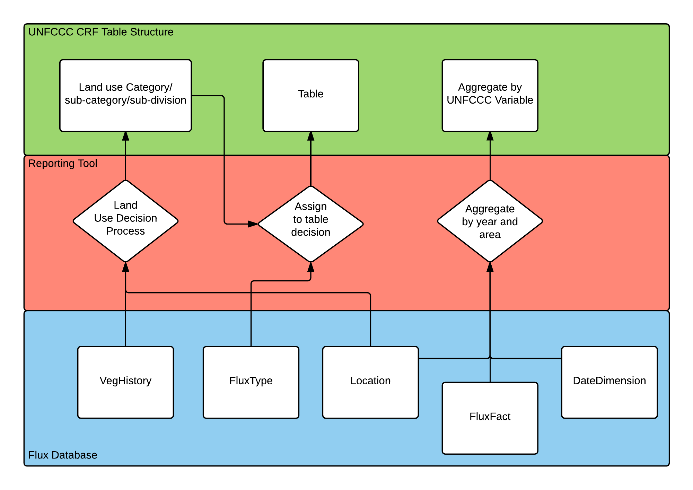
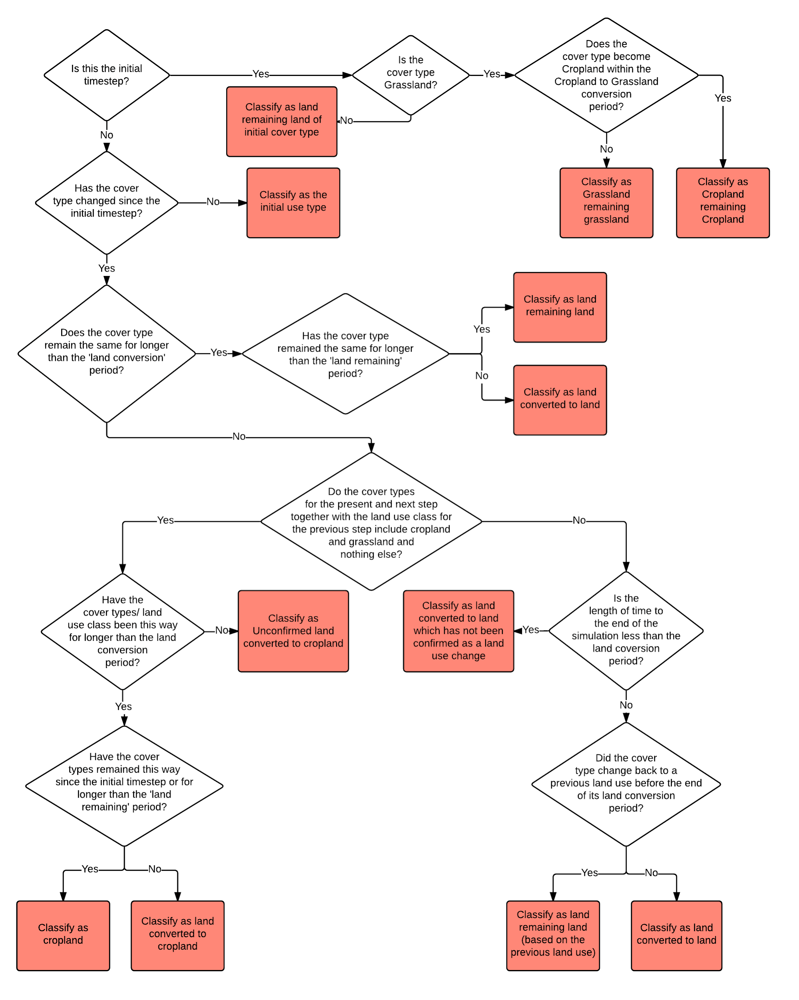

Execution Flow
==============

Overview
--------

The role of the Reporting Tool is to provide Business Intelligence for
analysing and transforming FLINT output databases into useful
information and outputs. The current implementation of the Reporting
Tool processes the Flux database into simplified 2006 GL Reporting
Tables. The figure below outlines the three key processes that the
Reporting Tool does to achieve this.

The big picture is that the Reporting Tool takes flux facts and
assigns/aggregates them to a land-use category, a reporting table and a
UNFCCC reporting variable.

To do this:

1. The Reporting Tool first implements a process that allocates a flux
   to an IPCC Land Use Category: This is identified as the Land Use
   Decision Process.

2. Secondly, it implements a process to allocate the flux to a 2006 GL
   Reporting Table: This is identified as the Flux Type to Reporting
   Table Process.

3. Finally, it aggregates the fluxes according to the UNFCCC variable:
   This is simply identified as the Aggregation Process.

The further sections explore these processes in detail.

Land Use Decision Process
-------------------------

The land-use decision process is used to assign a UNFCCC land use
category for each year for each flux and its associated land area.

The decisions of which IPCC land use category to assign are made based
upon the Vegetation History Dimension (VegHistoryDim) and it's
associated dimensions in the Flux database. The VegHistoryDim contains
information on the vegetation type (VegType) for each year of the
simulation, including the initial type. The VegType is associated with
an IPCC cover type which is used in the land use decision process, to
decide which land use category to assign for each year.

The land use decision process supports all of the IPCC land use
categories and their sub-classifications of land use 'remaining' land
use and land use 'converted to' land use.

The figure on the next page outlines the Reporting Tool’s land use
decision process. The Reporting Tool triggers this process whenever a
new Flux Output database is added to the system.

Flux Type to Reporting Table Process
------------------------------------

The FluxType in combination with the land use classification determines
the Reporting Table that a Flux is aggregated. The table below indicates
which table the Reporting Tool aggregates Fluxes for each combination of
Flux Type, Land Use Class and Emissions Type (CO2 (carbon stock change
as well as CO2), CH4 and N2O).

+--+------------------+--------------+--------------------------------------------------------------------------------------------------------------------------------------------------------------------------------------------------------+-----+-----------+-----------+
|id|Flux Type         |Land Use Class|Description                                                                                                                                                                                             |CO2  |CH4        |N2O        |
+==+==================+==============+========================================================================================================================================================================================================+=====+===========+===========+
|1 |Wildfire          |Forest land   |Fluxes that are the result of a wildfire disturbance event. This can include emissions to the atmosphere as well as transfers between pools and can include carbon and other non-carbon greenhouse gases|4.A  |4(V)       |4(V)       |
+--+------------------+--------------+--------------------------------------------------------------------------------------------------------------------------------------------------------------------------------------------------------+-----+-----------+-----------+
|1 |Wildfire          |Cropland      |Fluxes that are the result of a wildfire disturbance event. This can include emissions to the atmosphere as well as transfers between pools and can include carbon and other non-carbon greenhouse gases|4.B  |4(V) or 3.F|4(V) or 3.F|
+--+------------------+--------------+--------------------------------------------------------------------------------------------------------------------------------------------------------------------------------------------------------+-----+-----------+-----------+
|1 |Wildfire          |Grassland     |Fluxes that are the result of a wildfire disturbance event. This can include emissions to the atmosphere as well as transfers between pools and can include carbon and other non-carbon greenhouse gases|4.C  |4(V) or 3.E|4(V) or 3.E|
+--+------------------+--------------+--------------------------------------------------------------------------------------------------------------------------------------------------------------------------------------------------------+-----+-----------+-----------+
|1 |Wildfire          |Wetlands      |Fluxes that are the result of a wildfire disturbance event. This can include emissions to the atmosphere as well as transfers between pools and can include carbon and other non-carbon greenhouse gases|4.D  |4(V)       |4(V)       |
+--+------------------+--------------+--------------------------------------------------------------------------------------------------------------------------------------------------------------------------------------------------------+-----+-----------+-----------+
|1 |Wildfire          |Settlements   |Fluxes that are the result of a wildfire disturbance event. This can include emissions to the atmosphere as well as transfers between pools and can include carbon and other non-carbon greenhouse gases|4.E  |4(V)       |4(V)       |
+--+------------------+--------------+--------------------------------------------------------------------------------------------------------------------------------------------------------------------------------------------------------+-----+-----------+-----------+
|2 |Controlled Burning|Forest land   |Fluxes that are the result of a controlled burning disturbance. This can include emissions to the atmosphere as well as transfers between pools                                                         |4.A  |4(V)       |4(V)       |
+--+------------------+--------------+--------------------------------------------------------------------------------------------------------------------------------------------------------------------------------------------------------+-----+-----------+-----------+
|2 |Controlled Burning|Cropland      |Fluxes that are the result of a controlled burning disturbance. This can include emissions to the atmosphere as well as transfers between pools                                                         |4.B  |4(V) or 3.F|4(V) or 3.F|
+--+------------------+--------------+--------------------------------------------------------------------------------------------------------------------------------------------------------------------------------------------------------+-----+-----------+-----------+
|2 |Controlled Burning|Grassland     |Fluxes that are the result of a controlled burning disturbance. This can include emissions to the atmosphere as well as transfers between pools                                                         |4.C  |4(V) or 3.E|4(V) or 3.E|
+--+------------------+--------------+--------------------------------------------------------------------------------------------------------------------------------------------------------------------------------------------------------+-----+-----------+-----------+
|2 |Controlled Burning|Wetlands      |Fluxes that are the result of a controlled burning disturbance. This can include emissions to the atmosphere as well as transfers between pools                                                         |4.D  |4(V)       |4(V)       |
+--+------------------+--------------+--------------------------------------------------------------------------------------------------------------------------------------------------------------------------------------------------------+-----+-----------+-----------+
|2 |Controlled Burning|Settlements   |Fluxes that are the result of a controlled burning disturbance. This can include emissions to the atmosphere as well as transfers between pools                                                         |4.E  |4(V)       |4(V)       |
+--+------------------+--------------+--------------------------------------------------------------------------------------------------------------------------------------------------------------------------------------------------------+-----+-----------+-----------+
|3 |NPP               |Forest land   |Net primary production - the mass of photosynthate remaining after taking into account loss due to autotrophic respiration                                                                              |4.A  |NA         |NA         |
+--+------------------+--------------+--------------------------------------------------------------------------------------------------------------------------------------------------------------------------------------------------------+-----+-----------+-----------+
|3 |NPP               |Cropland      |Net primary production - the mass of photosynthate remaining after taking into account loss due to autotrophic respiration                                                                              |4.B  |NA         |NA         |
+--+------------------+--------------+--------------------------------------------------------------------------------------------------------------------------------------------------------------------------------------------------------+-----+-----------+-----------+
|3 |NPP               |Grassland     |Net primary production - the mass of photosynthate remaining after taking into account loss due to autotrophic respiration                                                                              |4.C  |NA         |NA         |
+--+------------------+--------------+--------------------------------------------------------------------------------------------------------------------------------------------------------------------------------------------------------+-----+-----------+-----------+
|3 |NPP               |Wetlands      |Net primary production - the mass of photosynthate remaining after taking into account loss due to autotrophic respiration                                                                              |4.D  |NA         |NA         |
+--+------------------+--------------+--------------------------------------------------------------------------------------------------------------------------------------------------------------------------------------------------------+-----+-----------+-----------+
|3 |NPP               |Settlements   |Net primary production - the mass of photosynthate remaining after taking into account loss due to autotrophic respiration                                                                              |4.E  |NA         |NA         |
+--+------------------+--------------+--------------------------------------------------------------------------------------------------------------------------------------------------------------------------------------------------------+-----+-----------+-----------+
|4 |Harvest           |Forest land   |Fluxes that are the result of a harvest event where all trees are harvested which can be fluxes between onsite pools or can be fluxes to offsite pools                                                  |4.A  |NA         |NA         |
+--+------------------+--------------+--------------------------------------------------------------------------------------------------------------------------------------------------------------------------------------------------------+-----+-----------+-----------+
|4 |Harvest           |Grassland     |Fluxes that are the result of a harvest event where woody and/or non-woody veg is harvested which can be fluxes between onsite pools or can be fluxes to offsite pools                                  |4.C  |NA         |NA         |
+--+------------------+--------------+--------------------------------------------------------------------------------------------------------------------------------------------------------------------------------------------------------+-----+-----------+-----------+
|4 |Harvest           |Cropland      |Fluxes that are the result of a harvest event where woody and/or non-woody veg is harvested which can be fluxes between onsite pools or can be fluxes to offsite pools                                  |4.B  |NA         |NA         |
+--+------------------+--------------+--------------------------------------------------------------------------------------------------------------------------------------------------------------------------------------------------------+-----+-----------+-----------+
|5 |Decomposition     |Forest land   |Fluxes to the atmosphere due to the decay of organic matter in dead organic matter and soil                                                                                                             |4.A  |NA         |4(III)     |
+--+------------------+--------------+--------------------------------------------------------------------------------------------------------------------------------------------------------------------------------------------------------+-----+-----------+-----------+
|5 |Decomposition     |Cropland      |Fluxes to the atmosphere due to the decay of organic matter in dead organic matter and soil                                                                                                             |4.B  |NA         |3.D        |
+--+------------------+--------------+--------------------------------------------------------------------------------------------------------------------------------------------------------------------------------------------------------+-----+-----------+-----------+
|5 |Decomposition     |Grassland     |Fluxes to the atmosphere due to the decay of organic matter in dead organic matter and soil                                                                                                             |4.C  |NA         |4(III)     |
+--+------------------+--------------+--------------------------------------------------------------------------------------------------------------------------------------------------------------------------------------------------------+-----+-----------+-----------+
|5 |Decomposition     |Wetlands      |Fluxes to the atmosphere due to the decay of organic matter in dead organic matter and soil                                                                                                             |4.D  |NA         |4(III)     |
+--+------------------+--------------+--------------------------------------------------------------------------------------------------------------------------------------------------------------------------------------------------------+-----+-----------+-----------+
|5 |Decomposition     |Settlements   |Fluxes to the atmosphere due to the decay of organic matter in dead organic matter and soil                                                                                                             |4.E  |NA         |4(III)     |
+--+------------------+--------------+--------------------------------------------------------------------------------------------------------------------------------------------------------------------------------------------------------+-----+-----------+-----------+
|6 |Turnover          |Forest land   |Fluxes due to normal processes of leaf, bark, and branch shedding and movement through debris and soil carbon pools due to decay                                                                        |4.A  |NA         |NA         |
+--+------------------+--------------+--------------------------------------------------------------------------------------------------------------------------------------------------------------------------------------------------------+-----+-----------+-----------+
|6 |Turnover          |Cropland      |Fluxes due to normal processes of leaf, bark, and branch shedding and movement through debris and soil carbon pools due to decay                                                                        |4.B  |NA         |NA         |
+--+------------------+--------------+--------------------------------------------------------------------------------------------------------------------------------------------------------------------------------------------------------+-----+-----------+-----------+
|6 |Turnover          |Grassland     |Fluxes due to normal processes of leaf, bark, and branch shedding and movement through debris and soil carbon pools due to decay                                                                        |4.C  |NA         |NA         |
+--+------------------+--------------+--------------------------------------------------------------------------------------------------------------------------------------------------------------------------------------------------------+-----+-----------+-----------+
|6 |Turnover          |Wetlands      |Fluxes due to normal processes of leaf, bark, and branch shedding and movement through debris and soil carbon pools due to decay                                                                        |4.D  |NA         |NA         |
+--+------------------+--------------+--------------------------------------------------------------------------------------------------------------------------------------------------------------------------------------------------------+-----+-----------+-----------+
|6 |Turnover          |Settlements   |Fluxes due to normal processes of leaf, bark, and branch shedding and movement through debris and soil carbon pools due to decay                                                                        |4.E  |NA         |NA         |
+--+------------------+--------------+--------------------------------------------------------------------------------------------------------------------------------------------------------------------------------------------------------+-----+-----------+-----------+
|7 |Plough            |Cropland      |Fluxes from a tillage disturbance on crop and grass                                                                                                                                                     |4.B  |NA         |NA         |
+--+------------------+--------------+--------------------------------------------------------------------------------------------------------------------------------------------------------------------------------------------------------+-----+-----------+-----------+
|7 |Plough            |Grassland     |Fluxes from a tillage disturbance on crop and grass                                                                                                                                                     |4.C  |NA         |NA         |
+--+------------------+--------------+--------------------------------------------------------------------------------------------------------------------------------------------------------------------------------------------------------+-----+-----------+-----------+
|8 |Thin              |Forest land   |Fluxes that are the result of a thin event where not all trees are harvested or felled which can be fluxes between onsite pools or can be fluxes to offsite pools                                       |4.A  |NA         |NA         |
+--+------------------+--------------+--------------------------------------------------------------------------------------------------------------------------------------------------------------------------------------------------------+-----+-----------+-----------+
|8 |Thin              |Grassland     |Fluxes that are the result of a thin event where not all woody veg is harvested or felled which can be fluxes between onsite pools or can be fluxes to offsite pools                                    |4.B  |NA         |NA         |
+--+------------------+--------------+--------------------------------------------------------------------------------------------------------------------------------------------------------------------------------------------------------+-----+-----------+-----------+
|8 |Thin              |Cropland      |Fluxes that are the result of a thin event where not all woody veg is harvested or felled which can be fluxes between onsite pools or can be fluxes to offsite pools                                    |4.C  |NA         |NA         |
+--+------------------+--------------+--------------------------------------------------------------------------------------------------------------------------------------------------------------------------------------------------------+-----+-----------+-----------+
|9 |Plant Trees       |Forest land   |When tree seedlings are planted there is a small carbon flux from offsite to tree pools                                                                                                                 |4.A  |NA         |NA         |
+--+------------------+--------------+--------------------------------------------------------------------------------------------------------------------------------------------------------------------------------------------------------+-----+-----------+-----------+
|10|Plant Crops       |Cropland      |When crops are sown or planted there is a carbon flux from offsite to crop pools                                                                                                                        |4.B  |NA         |NA         |
+--+------------------+--------------+--------------------------------------------------------------------------------------------------------------------------------------------------------------------------------------------------------+-----+-----------+-----------+
|11|N Fertiliser      |Forest land   |A flux that is the result of nitrogen fertiliser application                                                                                                                                            |NA   |NA         |4(I)       |
+--+------------------+--------------+--------------------------------------------------------------------------------------------------------------------------------------------------------------------------------------------------------+-----+-----------+-----------+
|11|N Fertiliser      |Cropland      |A flux that is the result of nitrogen fertiliser application                                                                                                                                            |NA   |NA         |3.D        |
+--+------------------+--------------+--------------------------------------------------------------------------------------------------------------------------------------------------------------------------------------------------------+-----+-----------+-----------+
|11|N Fertiliser      |Grassland     |A flux that is the result of nitrogen fertiliser application                                                                                                                                            |NA   |NA         |3.D        |
+--+------------------+--------------+--------------------------------------------------------------------------------------------------------------------------------------------------------------------------------------------------------+-----+-----------+-----------+
|11|N Fertiliser      |Wetlands      |A flux that is the result of nitrogen fertiliser application                                                                                                                                            |NA   |NA         |4(I)       |
+--+------------------+--------------+--------------------------------------------------------------------------------------------------------------------------------------------------------------------------------------------------------+-----+-----------+-----------+
|11|N Fertiliser      |Settlements   |A flux that is the result of nitrogen fertiliser application                                                                                                                                            |NA   |NA         |4(I)       |
+--+------------------+--------------+--------------------------------------------------------------------------------------------------------------------------------------------------------------------------------------------------------+-----+-----------+-----------+
|12|Pest              |Forest land   |Fluxes due to pest attack, for example transfer of leaves to the fine litter pools.                                                                                                                     |4.A  |NA         |NA         |
+--+------------------+--------------+--------------------------------------------------------------------------------------------------------------------------------------------------------------------------------------------------------+-----+-----------+-----------+
|12|Pest              |Cropland      |Fluxes due to pest attack, for example transfer of leaves to the fine litter pools.                                                                                                                     |4.B  |NA         |NA         |
+--+------------------+--------------+--------------------------------------------------------------------------------------------------------------------------------------------------------------------------------------------------------+-----+-----------+-----------+
|12|Pest              |Grassland     |Fluxes due to pest attack, for example transfer of leaves to the fine litter pools.                                                                                                                     |4.C  |NA         |NA         |
+--+------------------+--------------+--------------------------------------------------------------------------------------------------------------------------------------------------------------------------------------------------------+-----+-----------+-----------+
|13|Windthrow         |Forest land   |fluxes due to tree death due to being blown over by wind                                                                                                                                                |4.A  |NA         |NA         |
+--+------------------+--------------+--------------------------------------------------------------------------------------------------------------------------------------------------------------------------------------------------------+-----+-----------+-----------+
|14|Lime Application  |Forest land   |carbon fluxes associated with lime and dolomite application                                                                                                                                             |3.G.I|NA         |NA         |
+--+------------------+--------------+--------------------------------------------------------------------------------------------------------------------------------------------------------------------------------------------------------+-----+-----------+-----------+
|14|Lime Application  |Cropland      |carbon fluxes associated with lime and dolomite application                                                                                                                                             |3.G.I|NA         |NA         |
+--+------------------+--------------+--------------------------------------------------------------------------------------------------------------------------------------------------------------------------------------------------------+-----+-----------+-----------+
|14|Lime Application  |Grassland     |carbon fluxes associated with lime and dolomite application                                                                                                                                             |3.G.I|NA         |NA         |
+--+------------------+--------------+--------------------------------------------------------------------------------------------------------------------------------------------------------------------------------------------------------+-----+-----------+-----------+
|14|Lime Application  |Wetlands      |carbon fluxes associated with lime and dolomite application                                                                                                                                             |3.G.I|NA         |NA         |
+--+------------------+--------------+--------------------------------------------------------------------------------------------------------------------------------------------------------------------------------------------------------+-----+-----------+-----------+
|14|Lime Application  |Settlements   |carbon fluxes associated with lime and dolomite application                                                                                                                                             |3.G.I|NA         |NA         |
+--+------------------+--------------+--------------------------------------------------------------------------------------------------------------------------------------------------------------------------------------------------------+-----+-----------+-----------+
|15|Grazing           |Cropland      |fluxes between plant pools due to animal grazing                                                                                                                                                        |4.B  |NA         |NA         |
+--+------------------+--------------+--------------------------------------------------------------------------------------------------------------------------------------------------------------------------------------------------------+-----+-----------+-----------+
|15|Grazing           |Grassland     |fluxes between plant pools due to animal grazing                                                                                                                                                        |4.C  |NA         |NA         |
+--+------------------+--------------+--------------------------------------------------------------------------------------------------------------------------------------------------------------------------------------------------------+-----+-----------+-----------+
|16|Irrigation        |Forest land   |H20 fluxes due to irrigation                                                                                                                                                                            |NA   |NA         |NA         |
+--+------------------+--------------+--------------------------------------------------------------------------------------------------------------------------------------------------------------------------------------------------------+-----+-----------+-----------+
|16|Irrigation        |Cropland      |H20 fluxes due to irrigation                                                                                                                                                                            |NA   |NA         |NA         |
+--+------------------+--------------+--------------------------------------------------------------------------------------------------------------------------------------------------------------------------------------------------------+-----+-----------+-----------+
|16|Irrigation        |Grassland     |H20 fluxes due to irrigation                                                                                                                                                                            |NA   |NA         |NA         |
+--+------------------+--------------+--------------------------------------------------------------------------------------------------------------------------------------------------------------------------------------------------------+-----+-----------+-----------+
|17|Herbicide         |Forest land   |fluxes due to plant death from herbicide application                                                                                                                                                    |4.A  |NA         |NA         |
+--+------------------+--------------+--------------------------------------------------------------------------------------------------------------------------------------------------------------------------------------------------------+-----+-----------+-----------+
|17|Herbicide         |Cropland      |fluxes due to plant death from herbicide application                                                                                                                                                    |4.B  |NA         |NA         |
+--+------------------+--------------+--------------------------------------------------------------------------------------------------------------------------------------------------------------------------------------------------------+-----+-----------+-----------+
|17|Herbicide         |Grassland     |fluxes due to plant death from herbicide application                                                                                                                                                    |4.C  |NA         |NA         |
+--+------------------+--------------+--------------------------------------------------------------------------------------------------------------------------------------------------------------------------------------------------------+-----+-----------+-----------+
|18|Manure            |Forest land   |Fluxes from the application of manure from offsite                                                                                                                                                      |4.A  |3.B(a)     |3.B(b)     |
+--+------------------+--------------+--------------------------------------------------------------------------------------------------------------------------------------------------------------------------------------------------------+-----+-----------+-----------+
|18|Manure            |Cropland      |Fluxes from the application of manure from offsite                                                                                                                                                      |4.B  |3.B(a)     |3.B(b)     |
+--+------------------+--------------+--------------------------------------------------------------------------------------------------------------------------------------------------------------------------------------------------------+-----+-----------+-----------+
|18|Manure            |Grassland     |Fluxes from the application of manure from offsite                                                                                                                                                      |4.C  |3.B(a)     |3.B(b)     |
+--+------------------+--------------+--------------------------------------------------------------------------------------------------------------------------------------------------------------------------------------------------------+-----+-----------+-----------+
|19|Heavy roll        |Forest land   |flux of carbon due to chopper rolling                                                                                                                                                                   |4.A  |NA         |NA         |
+--+------------------+--------------+--------------------------------------------------------------------------------------------------------------------------------------------------------------------------------------------------------+-----+-----------+-----------+
|20|Wetland Drainage  |Forest land   |Flux of CO2 ,CH4 and N2O due to wetland drainage and rewetting                                                                                                                                          |4(II)|4(II)      |4(II)      |
+--+------------------+--------------+--------------------------------------------------------------------------------------------------------------------------------------------------------------------------------------------------------+-----+-----------+-----------+
|20|Wetland Drainage  |Cropland      |Flux of CO2 ,CH4 and N2O due to wetland drainage and rewetting                                                                                                                                          |4(II)|4(II)      |3.D        |
+--+------------------+--------------+--------------------------------------------------------------------------------------------------------------------------------------------------------------------------------------------------------+-----+-----------+-----------+
|20|Wetland Drainage  |Grassland     |Flux of CO2 ,CH4 and N2O due to wetland drainage and rewetting                                                                                                                                          |4(II)|4(II)      |3.D        |
+--+------------------+--------------+--------------------------------------------------------------------------------------------------------------------------------------------------------------------------------------------------------+-----+-----------+-----------+
|20|Wetland Drainage  |Wetlands      |Flux of CO2 ,CH4 and N2O due to wetland drainage and rewetting                                                                                                                                          |4(II)|4(II)      |4(II)      |
+--+------------------+--------------+--------------------------------------------------------------------------------------------------------------------------------------------------------------------------------------------------------+-----+-----------+-----------+
|21|Rice              |Cropland      |Special case where ,CH4 is transmitted through the stem                                                                                                                                                 |NA   |3.C        |NA         |
+--+------------------+--------------+--------------------------------------------------------------------------------------------------------------------------------------------------------------------------------------------------------+-----+-----------+-----------+
|22|Cattle Grazing    |Forest land   |carbon fluxes due to cattle grazing                                                                                                                                                                     |4.A  |NA         |NA         |
+--+------------------+--------------+--------------------------------------------------------------------------------------------------------------------------------------------------------------------------------------------------------+-----+-----------+-----------+
|22|Cattle Grazing    |Cropland      |carbon fluxes due to cattle grazing                                                                                                                                                                     |4.B  |NA         |NA         |
+--+------------------+--------------+--------------------------------------------------------------------------------------------------------------------------------------------------------------------------------------------------------+-----+-----------+-----------+
|22|Cattle Grazing    |Grassland     |carbon fluxes due to cattle grazing                                                                                                                                                                     |4.C  |NA         |NA         |
+--+------------------+--------------+--------------------------------------------------------------------------------------------------------------------------------------------------------------------------------------------------------+-----+-----------+-----------+
|23|Sheep Grazing     |Forest land   |carbon fluxes due to sheep grazing                                                                                                                                                                      |4.A  |NA         |NA         |
+--+------------------+--------------+--------------------------------------------------------------------------------------------------------------------------------------------------------------------------------------------------------+-----+-----------+-----------+
|23|Sheep Grazing     |Cropland      |carbon fluxes due to sheep grazing                                                                                                                                                                      |4.B  |NA         |NA         |
+--+------------------+--------------+--------------------------------------------------------------------------------------------------------------------------------------------------------------------------------------------------------+-----+-----------+-----------+
|23|Sheep Grazing     |Grassland     |carbon fluxes due to sheep grazing                                                                                                                                                                      |4.C  |NA         |NA         |
+--+------------------+--------------+--------------------------------------------------------------------------------------------------------------------------------------------------------------------------------------------------------+-----+-----------+-----------+
|24|Goat Grazing      |Forest land   |carbon fluxes due to goat grazing                                                                                                                                                                       |4.A  |NA         |NA         |
+--+------------------+--------------+--------------------------------------------------------------------------------------------------------------------------------------------------------------------------------------------------------+-----+-----------+-----------+
|24|Goat Grazing      |Cropland      |carbon fluxes due to goat grazing                                                                                                                                                                       |4.B  |NA         |NA         |
+--+------------------+--------------+--------------------------------------------------------------------------------------------------------------------------------------------------------------------------------------------------------+-----+-----------+-----------+
|24|Goat Grazing      |Grassland     |carbon fluxes due to goat grazing                                                                                                                                                                       |4.C  |NA         |NA         |
+--+------------------+--------------+--------------------------------------------------------------------------------------------------------------------------------------------------------------------------------------------------------+-----+-----------+-----------+

Aggregation Process
-------------------

The FluxFact table in the Flux database captures where a Flux came from
(StartPool) and where it went to (EndPool). This makes it possible to
assign the flux to one of the IPCC carbon stock change pools as well as
to non-CO2 emissions.

The table below indicates how the Reporting Tool treats Flux Fact during
aggregation (adds, subtracts, or ignores them) for UNFCCC reporting
variables (simplified IPCC carbon stock change and emissions pools). A
flux is always positive (because it represents a movement of mass from
one pool to another) and as such it is either added (where it is a flux
into the pool in question) or subtracted (where it is a flux from the
pool in question).

+-----------------------------------------+-------------------------------------------------+------------------------------------------------------+-----------------------------------------------+-----------------------------------------------+----------------------------------------------+----------------------------------------------+
|FluxFact Start and End Pool Combinations |Net carbon stock change in living biomass  (kt C)|Net carbon stock change in dead organic matter  (kt C)|Net carbon stock change in mineral soils (kt C)|Net carbon stock change in organic soils (kt C)|CH4 (controlled burning and wildfire) (kt CH4)|N2O (controlled burning and wildfire) (kg N2O)|
+=========================================+=================================================+======================================================+===============================================+===============================================+==============================================+==============================================+
|AgDeadFineRoots:SoilBioF                 |NA                                               |subtract                                              |add                                            |add                                            |NA                                            |NA                                            |
+-----------------------------------------+-------------------------------------------------+------------------------------------------------------+-----------------------------------------------+-----------------------------------------------+----------------------------------------------+----------------------------------------------+
|AgDeadFineRoots:SoilBioS                 |NA                                               |subtract                                              |add                                            |add                                            |NA                                            |NA                                            |
+-----------------------------------------+-------------------------------------------------+------------------------------------------------------+-----------------------------------------------+-----------------------------------------------+----------------------------------------------+----------------------------------------------+
|AgDeadFineRoots:SoilDPM                  |NA                                               |subtract                                              |add                                            |add                                            |NA                                            |NA                                            |
+-----------------------------------------+-------------------------------------------------+------------------------------------------------------+-----------------------------------------------+-----------------------------------------------+----------------------------------------------+----------------------------------------------+
|AgDeadFineRoots:SoilHUM                  |NA                                               |subtract                                              |add                                            |add                                            |NA                                            |NA                                            |
+-----------------------------------------+-------------------------------------------------+------------------------------------------------------+-----------------------------------------------+-----------------------------------------------+----------------------------------------------+----------------------------------------------+
|AgDeadFineRoots:SoilIOM                  |NA                                               |subtract                                              |add                                            |add                                            |NA                                            |NA                                            |
+-----------------------------------------+-------------------------------------------------+------------------------------------------------------+-----------------------------------------------+-----------------------------------------------+----------------------------------------------+----------------------------------------------+
|AgDeadFineRoots:SoilRPM                  |NA                                               |subtract                                              |add                                            |add                                            |NA                                            |NA                                            |
+-----------------------------------------+-------------------------------------------------+------------------------------------------------------+-----------------------------------------------+-----------------------------------------------+----------------------------------------------+----------------------------------------------+
|AgFineLitter:Atmosphere CH4              |NA                                               |NA                                                    |NA                                             |NA                                             |add                                           |NA                                            |
+-----------------------------------------+-------------------------------------------------+------------------------------------------------------+-----------------------------------------------+-----------------------------------------------+----------------------------------------------+----------------------------------------------+
|AgFineLitter:Atmosphere N2O              |NA                                               |NA                                                    |NA                                             |NA                                             |NA                                            |add                                           |
+-----------------------------------------+-------------------------------------------------+------------------------------------------------------+-----------------------------------------------+-----------------------------------------------+----------------------------------------------+----------------------------------------------+
|AgFineLitter:AtmosphereCO2               |NA                                               |subtract                                              |NA                                             |NA                                             |NA                                            |NA                                            |
+-----------------------------------------+-------------------------------------------------+------------------------------------------------------+-----------------------------------------------+-----------------------------------------------+----------------------------------------------+----------------------------------------------+
|AgFineLitter:SoilBioF                    |NA                                               |subtract                                              |add                                            |add                                            |NA                                            |NA                                            |
+-----------------------------------------+-------------------------------------------------+------------------------------------------------------+-----------------------------------------------+-----------------------------------------------+----------------------------------------------+----------------------------------------------+
|AgFineLitter:SoilBioS                    |NA                                               |subtract                                              |add                                            |add                                            |NA                                            |NA                                            |
+-----------------------------------------+-------------------------------------------------+------------------------------------------------------+-----------------------------------------------+-----------------------------------------------+----------------------------------------------+----------------------------------------------+
|AgFineLitter:SoilDPM                     |NA                                               |subtract                                              |add                                            |add                                            |NA                                            |NA                                            |
+-----------------------------------------+-------------------------------------------------+------------------------------------------------------+-----------------------------------------------+-----------------------------------------------+----------------------------------------------+----------------------------------------------+
|AgFineLitter:SoilHUM                     |NA                                               |subtract                                              |add                                            |add                                            |NA                                            |NA                                            |
+-----------------------------------------+-------------------------------------------------+------------------------------------------------------+-----------------------------------------------+-----------------------------------------------+----------------------------------------------+----------------------------------------------+
|AgFineLitter:SoilIOM                     |NA                                               |subtract                                              |add                                            |add                                            |NA                                            |NA                                            |
+-----------------------------------------+-------------------------------------------------+------------------------------------------------------+-----------------------------------------------+-----------------------------------------------+----------------------------------------------+----------------------------------------------+
|AgFineLitter:SoilRPM                     |NA                                               |subtract                                              |add                                            |add                                            |NA                                            |NA                                            |
+-----------------------------------------+-------------------------------------------------+------------------------------------------------------+-----------------------------------------------+-----------------------------------------------+----------------------------------------------+----------------------------------------------+
|AgOffSiteProduct:Atmosphere CH4          |NA                                               |NA                                                    |NA                                             |NA                                             |NA                                            |NA                                            |
+-----------------------------------------+-------------------------------------------------+------------------------------------------------------+-----------------------------------------------+-----------------------------------------------+----------------------------------------------+----------------------------------------------+
|AgOffSiteProduct:Atmosphere N2O          |NA                                               |NA                                                    |NA                                             |NA                                             |NA                                            |NA                                            |
+-----------------------------------------+-------------------------------------------------+------------------------------------------------------+-----------------------------------------------+-----------------------------------------------+----------------------------------------------+----------------------------------------------+
|AgOffSiteProduct:AtmosphereCO2           |NA                                               |NA                                                    |NA                                             |NA                                             |NA                                            |NA                                            |
+-----------------------------------------+-------------------------------------------------+------------------------------------------------------+-----------------------------------------------+-----------------------------------------------+----------------------------------------------+----------------------------------------------+
|AgStalkLitter:AgFineLitter               |NA                                               |NA                                                    |NA                                             |NA                                             |NA                                            |NA                                            |
+-----------------------------------------+-------------------------------------------------+------------------------------------------------------+-----------------------------------------------+-----------------------------------------------+----------------------------------------------+----------------------------------------------+
|AgStalkLitter:Atmosphere CH4             |NA                                               |NA                                                    |NA                                             |NA                                             |add                                           |NA                                            |
+-----------------------------------------+-------------------------------------------------+------------------------------------------------------+-----------------------------------------------+-----------------------------------------------+----------------------------------------------+----------------------------------------------+
|AgStalkLitter:Atmosphere N2O             |NA                                               |NA                                                    |NA                                             |NA                                             |NA                                            |add                                           |
+-----------------------------------------+-------------------------------------------------+------------------------------------------------------+-----------------------------------------------+-----------------------------------------------+----------------------------------------------+----------------------------------------------+
|AgStalkLitter:AtmosphereCO2              |NA                                               |subtract                                              |NA                                             |NA                                             |NA                                            |NA                                            |
+-----------------------------------------+-------------------------------------------------+------------------------------------------------------+-----------------------------------------------+-----------------------------------------------+----------------------------------------------+----------------------------------------------+
|AtmosphereCO2:CropFineRoot               |add                                              |NA                                                    |NA                                             |NA                                             |NA                                            |NA                                            |
+-----------------------------------------+-------------------------------------------------+------------------------------------------------------+-----------------------------------------------+-----------------------------------------------+----------------------------------------------+----------------------------------------------+
|AtmosphereCO2:CropGrain                  |add                                              |NA                                                    |NA                                             |NA                                             |NA                                            |NA                                            |
+-----------------------------------------+-------------------------------------------------+------------------------------------------------------+-----------------------------------------------+-----------------------------------------------+----------------------------------------------+----------------------------------------------+
|AtmosphereCO2:CropLeaf                   |add                                              |NA                                                    |NA                                             |NA                                             |NA                                            |NA                                            |
+-----------------------------------------+-------------------------------------------------+------------------------------------------------------+-----------------------------------------------+-----------------------------------------------+----------------------------------------------+----------------------------------------------+
|AtmosphereCO2:CropStalk                  |add                                              |NA                                                    |NA                                             |NA                                             |NA                                            |NA                                            |
+-----------------------------------------+-------------------------------------------------+------------------------------------------------------+-----------------------------------------------+-----------------------------------------------+----------------------------------------------+----------------------------------------------+
|AtmosphereCO2:GrassFineRoot              |add                                              |NA                                                    |NA                                             |NA                                             |NA                                            |NA                                            |
+-----------------------------------------+-------------------------------------------------+------------------------------------------------------+-----------------------------------------------+-----------------------------------------------+----------------------------------------------+----------------------------------------------+
|AtmosphereCO2:GrassLeaf                  |add                                              |NA                                                    |NA                                             |NA                                             |NA                                            |NA                                            |
+-----------------------------------------+-------------------------------------------------+------------------------------------------------------+-----------------------------------------------+-----------------------------------------------+----------------------------------------------+----------------------------------------------+
|AtmosphereCO2:TreeBark                   |add                                              |NA                                                    |NA                                             |NA                                             |NA                                            |NA                                            |
+-----------------------------------------+-------------------------------------------------+------------------------------------------------------+-----------------------------------------------+-----------------------------------------------+----------------------------------------------+----------------------------------------------+
|AtmosphereCO2:TreeBranch                 |add                                              |NA                                                    |NA                                             |NA                                             |NA                                            |NA                                            |
+-----------------------------------------+-------------------------------------------------+------------------------------------------------------+-----------------------------------------------+-----------------------------------------------+----------------------------------------------+----------------------------------------------+
|AtmosphereCO2:TreeCoarseRoot             |add                                              |NA                                                    |NA                                             |NA                                             |NA                                            |NA                                            |
+-----------------------------------------+-------------------------------------------------+------------------------------------------------------+-----------------------------------------------+-----------------------------------------------+----------------------------------------------+----------------------------------------------+
|AtmosphereCO2:TreeFineRoot               |add                                              |NA                                                    |NA                                             |NA                                             |NA                                            |NA                                            |
+-----------------------------------------+-------------------------------------------------+------------------------------------------------------+-----------------------------------------------+-----------------------------------------------+----------------------------------------------+----------------------------------------------+
|AtmosphereCO2:TreeFoliage                |add                                              |NA                                                    |NA                                             |NA                                             |NA                                            |NA                                            |
+-----------------------------------------+-------------------------------------------------+------------------------------------------------------+-----------------------------------------------+-----------------------------------------------+----------------------------------------------+----------------------------------------------+
|AtmosphereCO2:TreeStem                   |add                                              |NA                                                    |NA                                             |NA                                             |NA                                            |NA                                            |
+-----------------------------------------+-------------------------------------------------+------------------------------------------------------+-----------------------------------------------+-----------------------------------------------+----------------------------------------------+----------------------------------------------+
|BioChar:SoilDPM                          |NA                                               |NA                                                    |add                                            |add                                            |NA                                            |NA                                            |
+-----------------------------------------+-------------------------------------------------+------------------------------------------------------+-----------------------------------------------+-----------------------------------------------+----------------------------------------------+----------------------------------------------+
|BioChar:SoilIOM                          |NA                                               |NA                                                    |add                                            |add                                            |NA                                            |NA                                            |
+-----------------------------------------+-------------------------------------------------+------------------------------------------------------+-----------------------------------------------+-----------------------------------------------+----------------------------------------------+----------------------------------------------+
|BioChar:SoilRPM                          |NA                                               |NA                                                    |add                                            |add                                            |NA                                            |NA                                            |
+-----------------------------------------+-------------------------------------------------+------------------------------------------------------+-----------------------------------------------+-----------------------------------------------+----------------------------------------------+----------------------------------------------+
|CropFineRoot:AgDeadFineRoots             |subtract                                         |add                                                   |NA                                             |NA                                             |NA                                            |NA                                            |
+-----------------------------------------+-------------------------------------------------+------------------------------------------------------+-----------------------------------------------+-----------------------------------------------+----------------------------------------------+----------------------------------------------+
|CropGrain:AgFineLitter                   |subtract                                         |add                                                   |NA                                             |NA                                             |NA                                            |NA                                            |
+-----------------------------------------+-------------------------------------------------+------------------------------------------------------+-----------------------------------------------+-----------------------------------------------+----------------------------------------------+----------------------------------------------+
|CropGrain:AgOffSiteProduct               |subtract                                         |NA                                                    |NA                                             |NA                                             |NA                                            |NA                                            |
+-----------------------------------------+-------------------------------------------------+------------------------------------------------------+-----------------------------------------------+-----------------------------------------------+----------------------------------------------+----------------------------------------------+
|CropGrain:Atmosphere CH4                 |NA                                               |NA                                                    |NA                                             |NA                                             |add                                           |NA                                            |
+-----------------------------------------+-------------------------------------------------+------------------------------------------------------+-----------------------------------------------+-----------------------------------------------+----------------------------------------------+----------------------------------------------+
|CropGrain:Atmosphere N2O                 |NA                                               |NA                                                    |NA                                             |NA                                             |NA                                            |add                                           |
+-----------------------------------------+-------------------------------------------------+------------------------------------------------------+-----------------------------------------------+-----------------------------------------------+----------------------------------------------+----------------------------------------------+
|CropGrain:AtmosphereCO2                  |subtract                                         |NA                                                    |NA                                             |NA                                             |NA                                            |NA                                            |
+-----------------------------------------+-------------------------------------------------+------------------------------------------------------+-----------------------------------------------+-----------------------------------------------+----------------------------------------------+----------------------------------------------+
|CropLeaf:AgFineLitter                    |subtract                                         |add                                                   |NA                                             |NA                                             |NA                                            |NA                                            |
+-----------------------------------------+-------------------------------------------------+------------------------------------------------------+-----------------------------------------------+-----------------------------------------------+----------------------------------------------+----------------------------------------------+
|CropLeaf:AgOffSiteProduct                |subtract                                         |NA                                                    |NA                                             |NA                                             |NA                                            |NA                                            |
+-----------------------------------------+-------------------------------------------------+------------------------------------------------------+-----------------------------------------------+-----------------------------------------------+----------------------------------------------+----------------------------------------------+
|CropLeaf:Atmosphere CH4                  |NA                                               |NA                                                    |NA                                             |NA                                             |add                                           |NA                                            |
+-----------------------------------------+-------------------------------------------------+------------------------------------------------------+-----------------------------------------------+-----------------------------------------------+----------------------------------------------+----------------------------------------------+
|CropLeaf:Atmosphere N2O                  |NA                                               |NA                                                    |NA                                             |NA                                             |NA                                            |add                                           |
+-----------------------------------------+-------------------------------------------------+------------------------------------------------------+-----------------------------------------------+-----------------------------------------------+----------------------------------------------+----------------------------------------------+
|CropLeaf:AtmosphereCO2                   |subtract                                         |NA                                                    |NA                                             |NA                                             |NA                                            |NA                                            |
+-----------------------------------------+-------------------------------------------------+------------------------------------------------------+-----------------------------------------------+-----------------------------------------------+----------------------------------------------+----------------------------------------------+
|CropStalk:AgOffSiteProduct               |subtract                                         |NA                                                    |NA                                             |NA                                             |NA                                            |NA                                            |
+-----------------------------------------+-------------------------------------------------+------------------------------------------------------+-----------------------------------------------+-----------------------------------------------+----------------------------------------------+----------------------------------------------+
|CropStalk:AgStalkLitter                  |subtract                                         |add                                                   |NA                                             |NA                                             |NA                                            |NA                                            |
+-----------------------------------------+-------------------------------------------------+------------------------------------------------------+-----------------------------------------------+-----------------------------------------------+----------------------------------------------+----------------------------------------------+
|CropStalk:Atmosphere CH4                 |NA                                               |NA                                                    |NA                                             |NA                                             |add                                           |NA                                            |
+-----------------------------------------+-------------------------------------------------+------------------------------------------------------+-----------------------------------------------+-----------------------------------------------+----------------------------------------------+----------------------------------------------+
|CropStalk:Atmosphere N2O                 |subtract                                         |NA                                                    |NA                                             |NA                                             |NA                                            |add                                           |
+-----------------------------------------+-------------------------------------------------+------------------------------------------------------+-----------------------------------------------+-----------------------------------------------+----------------------------------------------+----------------------------------------------+
|CropStalk:AtmosphereCO2                  |subtract                                         |NA                                                    |NA                                             |NA                                             |NA                                            |NA                                            |
+-----------------------------------------+-------------------------------------------------+------------------------------------------------------+-----------------------------------------------+-----------------------------------------------+----------------------------------------------+----------------------------------------------+
|Deadwood:Atmosphere CH4                  |NA                                               |NA                                                    |NA                                             |NA                                             |add                                           |NA                                            |
+-----------------------------------------+-------------------------------------------------+------------------------------------------------------+-----------------------------------------------+-----------------------------------------------+----------------------------------------------+----------------------------------------------+
|Deadwood:Atmosphere N2O                  |NA                                               |NA                                                    |NA                                             |NA                                             |NA                                            |add                                           |
+-----------------------------------------+-------------------------------------------------+------------------------------------------------------+-----------------------------------------------+-----------------------------------------------+----------------------------------------------+----------------------------------------------+
|Deadwood:AtmosphereCO2                   |NA                                               |subtract                                              |NA                                             |NA                                             |NA                                            |NA                                            |
+-----------------------------------------+-------------------------------------------------+------------------------------------------------------+-----------------------------------------------+-----------------------------------------------+----------------------------------------------+----------------------------------------------+
|Deadwood:ForestOffSiteProduct            |NA                                               |subtract                                              |NA                                             |NA                                             |NA                                            |NA                                            |
+-----------------------------------------+-------------------------------------------------+------------------------------------------------------+-----------------------------------------------+-----------------------------------------------+----------------------------------------------+----------------------------------------------+
|Deadwood:SoilBioF                        |NA                                               |subtract                                              |add                                            |add                                            |NA                                            |NA                                            |
+-----------------------------------------+-------------------------------------------------+------------------------------------------------------+-----------------------------------------------+-----------------------------------------------+----------------------------------------------+----------------------------------------------+
|Deadwood:SoilBioS                        |NA                                               |subtract                                              |add                                            |add                                            |NA                                            |NA                                            |
+-----------------------------------------+-------------------------------------------------+------------------------------------------------------+-----------------------------------------------+-----------------------------------------------+----------------------------------------------+----------------------------------------------+
|Deadwood:SoilDPM                         |NA                                               |subtract                                              |add                                            |add                                            |NA                                            |NA                                            |
+-----------------------------------------+-------------------------------------------------+------------------------------------------------------+-----------------------------------------------+-----------------------------------------------+----------------------------------------------+----------------------------------------------+
|Deadwood:SoilHUM                         |NA                                               |subtract                                              |add                                            |add                                            |NA                                            |NA                                            |
+-----------------------------------------+-------------------------------------------------+------------------------------------------------------+-----------------------------------------------+-----------------------------------------------+----------------------------------------------+----------------------------------------------+
|Deadwood:SoilIOM                         |NA                                               |subtract                                              |add                                            |add                                            |NA                                            |NA                                            |
+-----------------------------------------+-------------------------------------------------+------------------------------------------------------+-----------------------------------------------+-----------------------------------------------+----------------------------------------------+----------------------------------------------+
|Deadwood:SoilRPM                         |NA                                               |subtract                                              |add                                            |add                                            |NA                                            |NA                                            |
+-----------------------------------------+-------------------------------------------------+------------------------------------------------------+-----------------------------------------------+-----------------------------------------------+----------------------------------------------+----------------------------------------------+
|Deadwood:TreeCoarseLitter                |NA                                               |NA                                                    |NA                                             |NA                                             |NA                                            |NA                                            |
+-----------------------------------------+-------------------------------------------------+------------------------------------------------------+-----------------------------------------------+-----------------------------------------------+----------------------------------------------+----------------------------------------------+
|Deadwood:TreeFineLitter                  |NA                                               |NA                                                    |NA                                             |NA                                             |NA                                            |NA                                            |
+-----------------------------------------+-------------------------------------------------+------------------------------------------------------+-----------------------------------------------+-----------------------------------------------+----------------------------------------------+----------------------------------------------+
|ForestOffSiteProduct:Atmosphere CH4      |NA                                               |NA                                                    |NA                                             |NA                                             |NA                                            |NA                                            |
+-----------------------------------------+-------------------------------------------------+------------------------------------------------------+-----------------------------------------------+-----------------------------------------------+----------------------------------------------+----------------------------------------------+
|ForestOffSiteProduct:Atmosphere N2O      |NA                                               |NA                                                    |NA                                             |NA                                             |NA                                            |NA                                            |
+-----------------------------------------+-------------------------------------------------+------------------------------------------------------+-----------------------------------------------+-----------------------------------------------+----------------------------------------------+----------------------------------------------+
|ForestOffSiteProduct:AtmosphereCO2       |NA                                               |NA                                                    |NA                                             |NA                                             |NA                                            |NA                                            |
+-----------------------------------------+-------------------------------------------------+------------------------------------------------------+-----------------------------------------------+-----------------------------------------------+----------------------------------------------+----------------------------------------------+
|GrassFineRoot:AgDeadFineRoots            |subtract                                         |add                                                   |NA                                             |NA                                             |NA                                            |NA                                            |
+-----------------------------------------+-------------------------------------------------+------------------------------------------------------+-----------------------------------------------+-----------------------------------------------+----------------------------------------------+----------------------------------------------+
|GrassFineRoot:AgOffSiteProduct           |subtract                                         |NA                                                    |NA                                             |NA                                             |NA                                            |NA                                            |
+-----------------------------------------+-------------------------------------------------+------------------------------------------------------+-----------------------------------------------+-----------------------------------------------+----------------------------------------------+----------------------------------------------+
|GrassLeaf:AgFineLitter                   |subtract                                         |add                                                   |NA                                             |NA                                             |NA                                            |NA                                            |
+-----------------------------------------+-------------------------------------------------+------------------------------------------------------+-----------------------------------------------+-----------------------------------------------+----------------------------------------------+----------------------------------------------+
|GrassLeaf:AgOffSiteProduct               |subtract                                         |NA                                                    |NA                                             |NA                                             |NA                                            |NA                                            |
+-----------------------------------------+-------------------------------------------------+------------------------------------------------------+-----------------------------------------------+-----------------------------------------------+----------------------------------------------+----------------------------------------------+
|GrassLeaf:Atmosphere CH4                 |NA                                               |NA                                                    |NA                                             |NA                                             |add                                           |NA                                            |
+-----------------------------------------+-------------------------------------------------+------------------------------------------------------+-----------------------------------------------+-----------------------------------------------+----------------------------------------------+----------------------------------------------+
|GrassLeaf:Atmosphere N2O                 |NA                                               |NA                                                    |NA                                             |NA                                             |NA                                            |add                                           |
+-----------------------------------------+-------------------------------------------------+------------------------------------------------------+-----------------------------------------------+-----------------------------------------------+----------------------------------------------+----------------------------------------------+
|GrassLeaf:AtmosphereCO2                  |subtract                                         |NA                                                    |NA                                             |NA                                             |NA                                            |NA                                            |
+-----------------------------------------+-------------------------------------------------+------------------------------------------------------+-----------------------------------------------+-----------------------------------------------+----------------------------------------------+----------------------------------------------+
|Manure:SoilBioF                          |NA                                               |NA                                                    |add                                            |add                                            |NA                                            |NA                                            |
+-----------------------------------------+-------------------------------------------------+------------------------------------------------------+-----------------------------------------------+-----------------------------------------------+----------------------------------------------+----------------------------------------------+
|Manure:SoilBioS                          |NA                                               |NA                                                    |add                                            |add                                            |NA                                            |NA                                            |
+-----------------------------------------+-------------------------------------------------+------------------------------------------------------+-----------------------------------------------+-----------------------------------------------+----------------------------------------------+----------------------------------------------+
|Manure:SoilDPM                           |NA                                               |NA                                                    |add                                            |add                                            |NA                                            |NA                                            |
+-----------------------------------------+-------------------------------------------------+------------------------------------------------------+-----------------------------------------------+-----------------------------------------------+----------------------------------------------+----------------------------------------------+
|Manure:SoilHUM                           |NA                                               |NA                                                    |add                                            |add                                            |NA                                            |NA                                            |
+-----------------------------------------+-------------------------------------------------+------------------------------------------------------+-----------------------------------------------+-----------------------------------------------+----------------------------------------------+----------------------------------------------+
|Manure:SoilIOM                           |NA                                               |NA                                                    |add                                            |add                                            |NA                                            |NA                                            |
+-----------------------------------------+-------------------------------------------------+------------------------------------------------------+-----------------------------------------------+-----------------------------------------------+----------------------------------------------+----------------------------------------------+
|Manure:SoilRPM                           |NA                                               |NA                                                    |add                                            |add                                            |NA                                            |NA                                            |
+-----------------------------------------+-------------------------------------------------+------------------------------------------------------+-----------------------------------------------+-----------------------------------------------+----------------------------------------------+----------------------------------------------+
|SoilBioF:Atmosphere N2O                  |NA                                               |NA                                                    |NA                                             |NA                                             |NA                                            |add                                           |
+-----------------------------------------+-------------------------------------------------+------------------------------------------------------+-----------------------------------------------+-----------------------------------------------+----------------------------------------------+----------------------------------------------+
|SoilBioF:AtmosphereCO2                   |NA                                               |NA                                                    |subtract                                       |subtract                                       |NA                                            |NA                                            |
+-----------------------------------------+-------------------------------------------------+------------------------------------------------------+-----------------------------------------------+-----------------------------------------------+----------------------------------------------+----------------------------------------------+
|SoilBioS:Atmosphere N2O                  |NA                                               |NA                                                    |NA                                             |NA                                             |NA                                            |add                                           |
+-----------------------------------------+-------------------------------------------------+------------------------------------------------------+-----------------------------------------------+-----------------------------------------------+----------------------------------------------+----------------------------------------------+
|SoilBioS:AtmosphereCO2                   |NA                                               |NA                                                    |subtract                                       |subtract                                       |NA                                            |NA                                            |
+-----------------------------------------+-------------------------------------------------+------------------------------------------------------+-----------------------------------------------+-----------------------------------------------+----------------------------------------------+----------------------------------------------+
|SoilDPM:Atmosphere N2O                   |NA                                               |NA                                                    |NA                                             |NA                                             |NA                                            |add                                           |
+-----------------------------------------+-------------------------------------------------+------------------------------------------------------+-----------------------------------------------+-----------------------------------------------+----------------------------------------------+----------------------------------------------+
|SoilDPM:AtmosphereCO2                    |NA                                               |NA                                                    |subtract                                       |subtract                                       |NA                                            |NA                                            |
+-----------------------------------------+-------------------------------------------------+------------------------------------------------------+-----------------------------------------------+-----------------------------------------------+----------------------------------------------+----------------------------------------------+
|SoilHUM:Atmosphere N2O                   |NA                                               |NA                                                    |NA                                             |NA                                             |NA                                            |add                                           |
+-----------------------------------------+-------------------------------------------------+------------------------------------------------------+-----------------------------------------------+-----------------------------------------------+----------------------------------------------+----------------------------------------------+
|SoilHUM:AtmosphereCO2                    |NA                                               |NA                                                    |subtract                                       |subtract                                       |NA                                            |NA                                            |
+-----------------------------------------+-------------------------------------------------+------------------------------------------------------+-----------------------------------------------+-----------------------------------------------+----------------------------------------------+----------------------------------------------+
|SoilHUM:SoilBioF                         |NA                                               |NA                                                    |NA                                             |NA                                             |NA                                            |NA                                            |
+-----------------------------------------+-------------------------------------------------+------------------------------------------------------+-----------------------------------------------+-----------------------------------------------+----------------------------------------------+----------------------------------------------+
|SoilHUM:SoilBioS                         |NA                                               |NA                                                    |NA                                             |NA                                             |NA                                            |NA                                            |
+-----------------------------------------+-------------------------------------------------+------------------------------------------------------+-----------------------------------------------+-----------------------------------------------+----------------------------------------------+----------------------------------------------+
|SoilIOM:Atmosphere N2O                   |NA                                               |NA                                                    |NA                                             |NA                                             |NA                                            |add                                           |
+-----------------------------------------+-------------------------------------------------+------------------------------------------------------+-----------------------------------------------+-----------------------------------------------+----------------------------------------------+----------------------------------------------+
|SoilIOM:AtmosphereCO2                    |NA                                               |NA                                                    |subtract                                       |subtract                                       |NA                                            |NA                                            |
+-----------------------------------------+-------------------------------------------------+------------------------------------------------------+-----------------------------------------------+-----------------------------------------------+----------------------------------------------+----------------------------------------------+
|SoilRPM:Atmosphere N2O                   |NA                                               |NA                                                    |NA                                             |NA                                             |NA                                            |add                                           |
+-----------------------------------------+-------------------------------------------------+------------------------------------------------------+-----------------------------------------------+-----------------------------------------------+----------------------------------------------+----------------------------------------------+
|SoilRPM:AtmosphereCO2                    |NA                                               |NA                                                    |subtract                                       |subtract                                       |NA                                            |NA                                            |
+-----------------------------------------+-------------------------------------------------+------------------------------------------------------+-----------------------------------------------+-----------------------------------------------+----------------------------------------------+----------------------------------------------+
|SoilRPM:SoilBioF                         |NA                                               |NA                                                    |NA                                             |NA                                             |NA                                            |NA                                            |
+-----------------------------------------+-------------------------------------------------+------------------------------------------------------+-----------------------------------------------+-----------------------------------------------+----------------------------------------------+----------------------------------------------+
|SoilRPM:SoilBioS                         |NA                                               |NA                                                    |NA                                             |NA                                             |NA                                            |NA                                            |
+-----------------------------------------+-------------------------------------------------+------------------------------------------------------+-----------------------------------------------+-----------------------------------------------+----------------------------------------------+----------------------------------------------+
|SoilRPM:SoilHUM                          |NA                                               |NA                                                    |NA                                             |NA                                             |NA                                            |NA                                            |
+-----------------------------------------+-------------------------------------------------+------------------------------------------------------+-----------------------------------------------+-----------------------------------------------+----------------------------------------------+----------------------------------------------+
|TreeBark:Atmosphere CH4                  |NA                                               |NA                                                    |NA                                             |NA                                             |add                                           |NA                                            |
+-----------------------------------------+-------------------------------------------------+------------------------------------------------------+-----------------------------------------------+-----------------------------------------------+----------------------------------------------+----------------------------------------------+
|TreeBark:Atmosphere N2O                  |NA                                               |NA                                                    |NA                                             |NA                                             |NA                                            |add                                           |
+-----------------------------------------+-------------------------------------------------+------------------------------------------------------+-----------------------------------------------+-----------------------------------------------+----------------------------------------------+----------------------------------------------+
|TreeBark:AtmosphereCO2                   |subtract                                         |NA                                                    |NA                                             |NA                                             |NA                                            |NA                                            |
+-----------------------------------------+-------------------------------------------------+------------------------------------------------------+-----------------------------------------------+-----------------------------------------------+----------------------------------------------+----------------------------------------------+
|TreeBark:ForestOffSiteProduct            |subtract                                         |NA                                                    |NA                                             |NA                                             |NA                                            |NA                                            |
+-----------------------------------------+-------------------------------------------------+------------------------------------------------------+-----------------------------------------------+-----------------------------------------------+----------------------------------------------+----------------------------------------------+
|TreeBark:TreeFineLitter                  |subtract                                         |add                                                   |NA                                             |NA                                             |NA                                            |NA                                            |
+-----------------------------------------+-------------------------------------------------+------------------------------------------------------+-----------------------------------------------+-----------------------------------------------+----------------------------------------------+----------------------------------------------+
|TreeBranch:Atmosphere CH4                |NA                                               |NA                                                    |NA                                             |NA                                             |add                                           |NA                                            |
+-----------------------------------------+-------------------------------------------------+------------------------------------------------------+-----------------------------------------------+-----------------------------------------------+----------------------------------------------+----------------------------------------------+
|TreeBranch:Atmosphere N2O                |NA                                               |NA                                                    |NA                                             |NA                                             |NA                                            |add                                           |
+-----------------------------------------+-------------------------------------------------+------------------------------------------------------+-----------------------------------------------+-----------------------------------------------+----------------------------------------------+----------------------------------------------+
|TreeBranch:AtmosphereCO2                 |subtract                                         |NA                                                    |NA                                             |NA                                             |NA                                            |NA                                            |
+-----------------------------------------+-------------------------------------------------+------------------------------------------------------+-----------------------------------------------+-----------------------------------------------+----------------------------------------------+----------------------------------------------+
|TreeBranch:Deadwood                      |subtract                                         |add                                                   |NA                                             |NA                                             |NA                                            |NA                                            |
+-----------------------------------------+-------------------------------------------------+------------------------------------------------------+-----------------------------------------------+-----------------------------------------------+----------------------------------------------+----------------------------------------------+
|TreeBranch:ForestOffSiteProduct          |subtract                                         |NA                                                    |NA                                             |NA                                             |NA                                            |NA                                            |
+-----------------------------------------+-------------------------------------------------+------------------------------------------------------+-----------------------------------------------+-----------------------------------------------+----------------------------------------------+----------------------------------------------+
|TreeBranch:TreeCoarseLitter              |subtract                                         |add                                                   |NA                                             |NA                                             |NA                                            |NA                                            |
+-----------------------------------------+-------------------------------------------------+------------------------------------------------------+-----------------------------------------------+-----------------------------------------------+----------------------------------------------+----------------------------------------------+
|TreeCoarseLitter:Atmosphere CH4          |NA                                               |NA                                                    |NA                                             |NA                                             |add                                           |NA                                            |
+-----------------------------------------+-------------------------------------------------+------------------------------------------------------+-----------------------------------------------+-----------------------------------------------+----------------------------------------------+----------------------------------------------+
|TreeCoarseLitter:Atmosphere N2O          |NA                                               |NA                                                    |NA                                             |NA                                             |NA                                            |add                                           |
+-----------------------------------------+-------------------------------------------------+------------------------------------------------------+-----------------------------------------------+-----------------------------------------------+----------------------------------------------+----------------------------------------------+
|TreeCoarseLitter:AtmosphereCO2           |NA                                               |subtract                                              |NA                                             |NA                                             |NA                                            |NA                                            |
+-----------------------------------------+-------------------------------------------------+------------------------------------------------------+-----------------------------------------------+-----------------------------------------------+----------------------------------------------+----------------------------------------------+
|TreeCoarseLitter:SoilBioF                |NA                                               |subtract                                              |add                                            |add                                            |NA                                            |NA                                            |
+-----------------------------------------+-------------------------------------------------+------------------------------------------------------+-----------------------------------------------+-----------------------------------------------+----------------------------------------------+----------------------------------------------+
|TreeCoarseLitter:SoilBioS                |NA                                               |subtract                                              |add                                            |add                                            |NA                                            |NA                                            |
+-----------------------------------------+-------------------------------------------------+------------------------------------------------------+-----------------------------------------------+-----------------------------------------------+----------------------------------------------+----------------------------------------------+
|TreeCoarseLitter:SoilDPM                 |NA                                               |subtract                                              |add                                            |add                                            |NA                                            |NA                                            |
+-----------------------------------------+-------------------------------------------------+------------------------------------------------------+-----------------------------------------------+-----------------------------------------------+----------------------------------------------+----------------------------------------------+
|TreeCoarseLitter:SoilHUM                 |NA                                               |subtract                                              |add                                            |add                                            |NA                                            |NA                                            |
+-----------------------------------------+-------------------------------------------------+------------------------------------------------------+-----------------------------------------------+-----------------------------------------------+----------------------------------------------+----------------------------------------------+
|TreeCoarseLitter:SoilIOM                 |NA                                               |subtract                                              |add                                            |add                                            |NA                                            |NA                                            |
+-----------------------------------------+-------------------------------------------------+------------------------------------------------------+-----------------------------------------------+-----------------------------------------------+----------------------------------------------+----------------------------------------------+
|TreeCoarseLitter:SoilRPM                 |NA                                               |subtract                                              |add                                            |add                                            |NA                                            |NA                                            |
+-----------------------------------------+-------------------------------------------------+------------------------------------------------------+-----------------------------------------------+-----------------------------------------------+----------------------------------------------+----------------------------------------------+
|TreeCoarseLitter:TreeFineLitter          |NA                                               |NA                                                    |NA                                             |NA                                             |NA                                            |NA                                            |
+-----------------------------------------+-------------------------------------------------+------------------------------------------------------+-----------------------------------------------+-----------------------------------------------+----------------------------------------------+----------------------------------------------+
|TreeCoarseRoot:Atmosphere CH4            |NA                                               |NA                                                    |NA                                             |NA                                             |add                                           |NA                                            |
+-----------------------------------------+-------------------------------------------------+------------------------------------------------------+-----------------------------------------------+-----------------------------------------------+----------------------------------------------+----------------------------------------------+
|TreeCoarseRoot:Atmosphere N2O            |NA                                               |NA                                                    |NA                                             |NA                                             |NA                                            |add                                           |
+-----------------------------------------+-------------------------------------------------+------------------------------------------------------+-----------------------------------------------+-----------------------------------------------+----------------------------------------------+----------------------------------------------+
|TreeCoarseRoot:AtmosphereCO2             |subtract                                         |NA                                                    |NA                                             |NA                                             |NA                                            |NA                                            |
+-----------------------------------------+-------------------------------------------------+------------------------------------------------------+-----------------------------------------------+-----------------------------------------------+----------------------------------------------+----------------------------------------------+
|TreeCoarseRoot:TreeDeadCoarseRoot        |subtract                                         |add                                                   |NA                                             |NA                                             |NA                                            |NA                                            |
+-----------------------------------------+-------------------------------------------------+------------------------------------------------------+-----------------------------------------------+-----------------------------------------------+----------------------------------------------+----------------------------------------------+
|TreeDeadCoarseRoot:Atmosphere CH4        |NA                                               |NA                                                    |NA                                             |NA                                             |add                                           |NA                                            |
+-----------------------------------------+-------------------------------------------------+------------------------------------------------------+-----------------------------------------------+-----------------------------------------------+----------------------------------------------+----------------------------------------------+
|TreeDeadCoarseRoot:Atmosphere N2O        |NA                                               |NA                                                    |NA                                             |NA                                             |NA                                            |add                                           |
+-----------------------------------------+-------------------------------------------------+------------------------------------------------------+-----------------------------------------------+-----------------------------------------------+----------------------------------------------+----------------------------------------------+
|TreeDeadCoarseRoot:AtmosphereCO2         |NA                                               |subtract                                              |NA                                             |NA                                             |NA                                            |NA                                            |
+-----------------------------------------+-------------------------------------------------+------------------------------------------------------+-----------------------------------------------+-----------------------------------------------+----------------------------------------------+----------------------------------------------+
|TreeDeadCoarseRoot:SoilBioF              |NA                                               |subtract                                              |add                                            |add                                            |NA                                            |NA                                            |
+-----------------------------------------+-------------------------------------------------+------------------------------------------------------+-----------------------------------------------+-----------------------------------------------+----------------------------------------------+----------------------------------------------+
|TreeDeadCoarseRoot:SoilBioS              |NA                                               |subtract                                              |add                                            |add                                            |NA                                            |NA                                            |
+-----------------------------------------+-------------------------------------------------+------------------------------------------------------+-----------------------------------------------+-----------------------------------------------+----------------------------------------------+----------------------------------------------+
|TreeDeadCoarseRoot:SoilDPM               |NA                                               |subtract                                              |add                                            |add                                            |NA                                            |NA                                            |
+-----------------------------------------+-------------------------------------------------+------------------------------------------------------+-----------------------------------------------+-----------------------------------------------+----------------------------------------------+----------------------------------------------+
|TreeDeadCoarseRoot:SoilHUM               |NA                                               |subtract                                              |add                                            |add                                            |NA                                            |NA                                            |
+-----------------------------------------+-------------------------------------------------+------------------------------------------------------+-----------------------------------------------+-----------------------------------------------+----------------------------------------------+----------------------------------------------+
|TreeDeadCoarseRoot:SoilIOM               |NA                                               |subtract                                              |add                                            |add                                            |NA                                            |NA                                            |
+-----------------------------------------+-------------------------------------------------+------------------------------------------------------+-----------------------------------------------+-----------------------------------------------+----------------------------------------------+----------------------------------------------+
|TreeDeadCoarseRoot:SoilRPM               |NA                                               |subtract                                              |add                                            |add                                            |NA                                            |NA                                            |
+-----------------------------------------+-------------------------------------------------+------------------------------------------------------+-----------------------------------------------+-----------------------------------------------+----------------------------------------------+----------------------------------------------+
|TreeDeadFineRoot:Atmosphere CH4          |NA                                               |NA                                                    |NA                                             |NA                                             |add                                           |NA                                            |
+-----------------------------------------+-------------------------------------------------+------------------------------------------------------+-----------------------------------------------+-----------------------------------------------+----------------------------------------------+----------------------------------------------+
|TreeDeadFineRoot:Atmosphere N2O          |NA                                               |NA                                                    |NA                                             |NA                                             |NA                                            |add                                           |
+-----------------------------------------+-------------------------------------------------+------------------------------------------------------+-----------------------------------------------+-----------------------------------------------+----------------------------------------------+----------------------------------------------+
|TreeDeadFineRoot:AtmosphereCO2           |NA                                               |subtract                                              |NA                                             |NA                                             |NA                                            |NA                                            |
+-----------------------------------------+-------------------------------------------------+------------------------------------------------------+-----------------------------------------------+-----------------------------------------------+----------------------------------------------+----------------------------------------------+
|TreeDeadFineRoot:SoilBioF                |NA                                               |subtract                                              |add                                            |add                                            |NA                                            |NA                                            |
+-----------------------------------------+-------------------------------------------------+------------------------------------------------------+-----------------------------------------------+-----------------------------------------------+----------------------------------------------+----------------------------------------------+
|TreeDeadFineRoot:SoilBioS                |NA                                               |subtract                                              |add                                            |add                                            |NA                                            |NA                                            |
+-----------------------------------------+-------------------------------------------------+------------------------------------------------------+-----------------------------------------------+-----------------------------------------------+----------------------------------------------+----------------------------------------------+
|TreeDeadFineRoot:SoilDPM                 |NA                                               |subtract                                              |add                                            |add                                            |NA                                            |NA                                            |
+-----------------------------------------+-------------------------------------------------+------------------------------------------------------+-----------------------------------------------+-----------------------------------------------+----------------------------------------------+----------------------------------------------+
|TreeDeadFineRoot:SoilHUM                 |NA                                               |subtract                                              |add                                            |add                                            |NA                                            |NA                                            |
+-----------------------------------------+-------------------------------------------------+------------------------------------------------------+-----------------------------------------------+-----------------------------------------------+----------------------------------------------+----------------------------------------------+
|TreeDeadFineRoot:SoilIOM                 |NA                                               |subtract                                              |add                                            |add                                            |NA                                            |NA                                            |
+-----------------------------------------+-------------------------------------------------+------------------------------------------------------+-----------------------------------------------+-----------------------------------------------+----------------------------------------------+----------------------------------------------+
|TreeDeadFineRoot:SoilRPM                 |NA                                               |subtract                                              |add                                            |add                                            |NA                                            |NA                                            |
+-----------------------------------------+-------------------------------------------------+------------------------------------------------------+-----------------------------------------------+-----------------------------------------------+----------------------------------------------+----------------------------------------------+
|TreeFineLitter:Atmosphere CH4            |NA                                               |NA                                                    |NA                                             |NA                                             |add                                           |NA                                            |
+-----------------------------------------+-------------------------------------------------+------------------------------------------------------+-----------------------------------------------+-----------------------------------------------+----------------------------------------------+----------------------------------------------+
|TreeFineLitter:Atmosphere N2O            |NA                                               |NA                                                    |NA                                             |NA                                             |NA                                            |add                                           |
+-----------------------------------------+-------------------------------------------------+------------------------------------------------------+-----------------------------------------------+-----------------------------------------------+----------------------------------------------+----------------------------------------------+
|TreeFineLitter:AtmosphereCO2             |NA                                               |subtract                                              |NA                                             |NA                                             |NA                                            |NA                                            |
+-----------------------------------------+-------------------------------------------------+------------------------------------------------------+-----------------------------------------------+-----------------------------------------------+----------------------------------------------+----------------------------------------------+
|TreeFineLitter:SoilBioF                  |NA                                               |subtract                                              |add                                            |add                                            |NA                                            |NA                                            |
+-----------------------------------------+-------------------------------------------------+------------------------------------------------------+-----------------------------------------------+-----------------------------------------------+----------------------------------------------+----------------------------------------------+
|TreeFineLitter:SoilBioS                  |NA                                               |subtract                                              |add                                            |add                                            |NA                                            |NA                                            |
+-----------------------------------------+-------------------------------------------------+------------------------------------------------------+-----------------------------------------------+-----------------------------------------------+----------------------------------------------+----------------------------------------------+
|TreeFineLitter:SoilDPM                   |NA                                               |subtract                                              |add                                            |add                                            |NA                                            |NA                                            |
+-----------------------------------------+-------------------------------------------------+------------------------------------------------------+-----------------------------------------------+-----------------------------------------------+----------------------------------------------+----------------------------------------------+
|TreeFineLitter:SoilHUM                   |NA                                               |subtract                                              |add                                            |add                                            |NA                                            |NA                                            |
+-----------------------------------------+-------------------------------------------------+------------------------------------------------------+-----------------------------------------------+-----------------------------------------------+----------------------------------------------+----------------------------------------------+
|TreeFineLitter:SoilIOM                   |NA                                               |subtract                                              |add                                            |add                                            |NA                                            |NA                                            |
+-----------------------------------------+-------------------------------------------------+------------------------------------------------------+-----------------------------------------------+-----------------------------------------------+----------------------------------------------+----------------------------------------------+
|TreeFineLitter:SoilRPM                   |NA                                               |subtract                                              |add                                            |add                                            |NA                                            |NA                                            |
+-----------------------------------------+-------------------------------------------------+------------------------------------------------------+-----------------------------------------------+-----------------------------------------------+----------------------------------------------+----------------------------------------------+
|TreeFineRoot:Atmosphere CH4              |NA                                               |NA                                                    |NA                                             |NA                                             |add                                           |NA                                            |
+-----------------------------------------+-------------------------------------------------+------------------------------------------------------+-----------------------------------------------+-----------------------------------------------+----------------------------------------------+----------------------------------------------+
|TreeFineRoot:Atmosphere N2O              |NA                                               |NA                                                    |NA                                             |NA                                             |NA                                            |add                                           |
+-----------------------------------------+-------------------------------------------------+------------------------------------------------------+-----------------------------------------------+-----------------------------------------------+----------------------------------------------+----------------------------------------------+
|TreeFineRoot:AtmosphereCO2               |subtract                                         |NA                                                    |NA                                             |NA                                             |NA                                            |NA                                            |
+-----------------------------------------+-------------------------------------------------+------------------------------------------------------+-----------------------------------------------+-----------------------------------------------+----------------------------------------------+----------------------------------------------+
|TreeFineRoot:TreeDeadFineRoot            |subtract                                         |NA                                                    |NA                                             |NA                                             |NA                                            |NA                                            |
+-----------------------------------------+-------------------------------------------------+------------------------------------------------------+-----------------------------------------------+-----------------------------------------------+----------------------------------------------+----------------------------------------------+
|TreeFoliage:Atmosphere CH4               |NA                                               |NA                                                    |NA                                             |NA                                             |add                                           |NA                                            |
+-----------------------------------------+-------------------------------------------------+------------------------------------------------------+-----------------------------------------------+-----------------------------------------------+----------------------------------------------+----------------------------------------------+
|TreeFoliage:Atmosphere N2O               |NA                                               |NA                                                    |NA                                             |NA                                             |NA                                            |add                                           |
+-----------------------------------------+-------------------------------------------------+------------------------------------------------------+-----------------------------------------------+-----------------------------------------------+----------------------------------------------+----------------------------------------------+
|TreeFoliage:AtmosphereCO2                |subtract                                         |NA                                                    |NA                                             |NA                                             |NA                                            |NA                                            |
+-----------------------------------------+-------------------------------------------------+------------------------------------------------------+-----------------------------------------------+-----------------------------------------------+----------------------------------------------+----------------------------------------------+
|TreeFoliage:ForestOffSiteProduct         |subtract                                         |NA                                                    |NA                                             |NA                                             |NA                                            |NA                                            |
+-----------------------------------------+-------------------------------------------------+------------------------------------------------------+-----------------------------------------------+-----------------------------------------------+----------------------------------------------+----------------------------------------------+
|TreeFoliage:TreeFineLitter               |subtract                                         |add                                                   |NA                                             |NA                                             |NA                                            |NA                                            |
+-----------------------------------------+-------------------------------------------------+------------------------------------------------------+-----------------------------------------------+-----------------------------------------------+----------------------------------------------+----------------------------------------------+
|TreePlanting:TreeBark                    |add                                              |NA                                                    |NA                                             |NA                                             |NA                                            |NA                                            |
+-----------------------------------------+-------------------------------------------------+------------------------------------------------------+-----------------------------------------------+-----------------------------------------------+----------------------------------------------+----------------------------------------------+
|TreePlanting:TreeBranch                  |add                                              |NA                                                    |NA                                             |NA                                             |NA                                            |NA                                            |
+-----------------------------------------+-------------------------------------------------+------------------------------------------------------+-----------------------------------------------+-----------------------------------------------+----------------------------------------------+----------------------------------------------+
|TreePlanting:TreeCoarseRoot              |add                                              |NA                                                    |NA                                             |NA                                             |NA                                            |NA                                            |
+-----------------------------------------+-------------------------------------------------+------------------------------------------------------+-----------------------------------------------+-----------------------------------------------+----------------------------------------------+----------------------------------------------+
|TreePlanting:TreeFineRoot                |add                                              |NA                                                    |NA                                             |NA                                             |NA                                            |NA                                            |
+-----------------------------------------+-------------------------------------------------+------------------------------------------------------+-----------------------------------------------+-----------------------------------------------+----------------------------------------------+----------------------------------------------+
|TreePlanting:TreeFoliage                 |add                                              |NA                                                    |NA                                             |NA                                             |NA                                            |NA                                            |
+-----------------------------------------+-------------------------------------------------+------------------------------------------------------+-----------------------------------------------+-----------------------------------------------+----------------------------------------------+----------------------------------------------+
|TreePlanting:TreeStem                    |add                                              |NA                                                    |NA                                             |NA                                             |NA                                            |NA                                            |
+-----------------------------------------+-------------------------------------------------+------------------------------------------------------+-----------------------------------------------+-----------------------------------------------+----------------------------------------------+----------------------------------------------+
|TreeStem:Atmosphere CH4                  |NA                                               |NA                                                    |NA                                             |NA                                             |add                                           |NA                                            |
+-----------------------------------------+-------------------------------------------------+------------------------------------------------------+-----------------------------------------------+-----------------------------------------------+----------------------------------------------+----------------------------------------------+
|TreeStem:Atmosphere N2O                  |NA                                               |NA                                                    |NA                                             |NA                                             |NA                                            |add                                           |
+-----------------------------------------+-------------------------------------------------+------------------------------------------------------+-----------------------------------------------+-----------------------------------------------+----------------------------------------------+----------------------------------------------+
|TreeStem:AtmosphereCO2                   |subtract                                         |NA                                                    |NA                                             |NA                                             |NA                                            |NA                                            |
+-----------------------------------------+-------------------------------------------------+------------------------------------------------------+-----------------------------------------------+-----------------------------------------------+----------------------------------------------+----------------------------------------------+
|TreeStem:Deadwood                        |subtract                                         |add                                                   |NA                                             |NA                                             |NA                                            |NA                                            |
+-----------------------------------------+-------------------------------------------------+------------------------------------------------------+-----------------------------------------------+-----------------------------------------------+----------------------------------------------+----------------------------------------------+
|TreeStem:ForestOffSiteProduct            |subtract                                         |NA                                                    |NA                                             |NA                                             |NA                                            |NA                                            |
+-----------------------------------------+-------------------------------------------------+------------------------------------------------------+-----------------------------------------------+-----------------------------------------------+----------------------------------------------+----------------------------------------------+
|TreeStem:TreeCoarseLitter                |subtract                                         |add                                                   |NA                                             |NA                                             |NA                                            |NA                                            |
+-----------------------------------------+-------------------------------------------------+------------------------------------------------------+-----------------------------------------------+-----------------------------------------------+----------------------------------------------+----------------------------------------------+
|ForestOffSiteProduct:ForestOffSiteProduct|NA                                               |NA                                                    |NA                                             |NA                                             |NA                                            |NA                                            |
+-----------------------------------------+-------------------------------------------------+------------------------------------------------------+-----------------------------------------------+-----------------------------------------------+----------------------------------------------+----------------------------------------------+
|AgOffSiteProduct:AgOffSiteProduct        |NA                                               |NA                                                    |NA                                             |NA                                             |NA                                            |NA                                            |
+-----------------------------------------+-------------------------------------------------+------------------------------------------------------+-----------------------------------------------+-----------------------------------------------+----------------------------------------------+----------------------------------------------+
|SoilDPM:Atmosphere CH4                   |NA                                               |NA                                                    |NA                                             |NA                                             |add                                           |NA                                            |
+-----------------------------------------+-------------------------------------------------+------------------------------------------------------+-----------------------------------------------+-----------------------------------------------+----------------------------------------------+----------------------------------------------+
|SoilRPM:Atmosphere CH4                   |NA                                               |NA                                                    |NA                                             |NA                                             |add                                           |NA                                            |
+-----------------------------------------+-------------------------------------------------+------------------------------------------------------+-----------------------------------------------+-----------------------------------------------+----------------------------------------------+----------------------------------------------+
|SoilBioF:Atmosphere CH4                  |NA                                               |NA                                                    |NA                                             |NA                                             |add                                           |NA                                            |
+-----------------------------------------+-------------------------------------------------+------------------------------------------------------+-----------------------------------------------+-----------------------------------------------+----------------------------------------------+----------------------------------------------+
|SoilBioS:Atmosphere CH4                  |NA                                               |NA                                                    |NA                                             |NA                                             |add                                           |NA                                            |
+-----------------------------------------+-------------------------------------------------+------------------------------------------------------+-----------------------------------------------+-----------------------------------------------+----------------------------------------------+----------------------------------------------+
|SoilHUM:Atmosphere CH4                   |NA                                               |NA                                                    |NA                                             |NA                                             |add                                           |NA                                            |
+-----------------------------------------+-------------------------------------------------+------------------------------------------------------+-----------------------------------------------+-----------------------------------------------+----------------------------------------------+----------------------------------------------+
|SoilIOM:Atmosphere CH4                   |NA                                               |NA                                                    |NA                                             |NA                                             |add                                           |NA                                            |
+-----------------------------------------+-------------------------------------------------+------------------------------------------------------+-----------------------------------------------+-----------------------------------------------+----------------------------------------------+----------------------------------------------+
