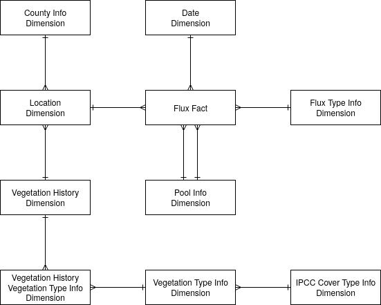
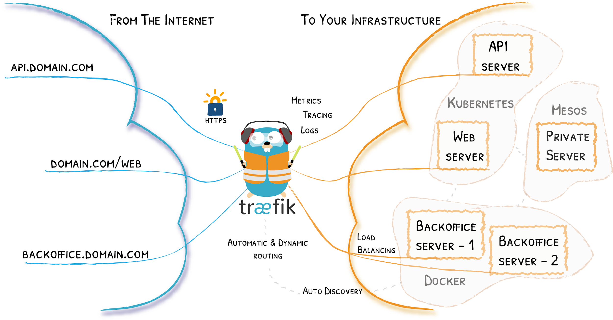

Functional Decomposition
========================

FLINT Output Databases
----------------------

The FLINT produces three output databases that are available for use in
the Reporting Tool: A Metadata, a FLUX and a STOCK database.

+-------------------+-------------------------------------------------+
| Database          | Description                                     |
+===================+=================================================+
| Metadata Database | The metadata database contains auxiliary and    |
|                   | summary information about the simulation. For   |
|                   | example, it includes:- Year Range, Spatial      |
|                   | Range, Input Data/Databases Used, Modules and   |
|                   | Configurations Used, Area/Count Of Simulation   |
|                   | and finally Error Summary - Summary of the      |
|                   | number/nature of errors produced during the     |
|                   | simulation                                      |
+-------------------+-------------------------------------------------+
| Stock Database    | The stock database captures information on the  |
|                   | amount of material in pools (e.g. carbon pools) |
+-------------------+-------------------------------------------------+
| Flux Database     | The flux database captures information on the   |
|                   | flux of material (e.g. carbon, nitrogen)        |
|                   | between pools.                                  |
+-------------------+-------------------------------------------------+

Since the first version of Moja Reporting Tool is more geared towards
Emissions Reporting and the Flux database is more directly linked to
emissions reporting requirements than the stock database, the sections
that follow only cover the design of the Flux Database in detail.

Flux Database
~~~~~~~~~~~~~

As mentioned previously, the Flux database is primarily concerned with
capturing 'facts' regarding fluxes between pools within the FLINT. It is
designed as a Star Schema which constitutes a 'Fact' Table that contains
flux values that are associated with attributes in a series of
'Dimension' tables. Fact and Dimension tables are linked via a dimension
id.

+--------------------------------+------------------------------------+
| Flux DB Table                  | Description                        |
+================================+====================================+
| Flux fact                      | The FluxFact table consists of     |
|                                | 'records' which have flux fact     |
|                                | attributes as well as attributes   |
|                                | that link to the dimension tables  |
|                                | through unique dimension           |
|                                | identifiers. The flux facts        |
|                                | include a flux value which is      |
|                                | always positive (because it        |
|                                | represents the movement of mass    |
|                                | from one pool (StartPool) to       |
|                                | another (EndPool)). In addition    |
|                                | the flux facts have attributes of  |
|                                | StartPool and EndPool, which       |
|                                | identifies the source pool of the  |
|                                | flux and the destination pool of   |
|                                | the flux. The StartPool and        |
|                                | EndPool can be used to determine   |
|                                | how a flux is related to the IPCC  |
|                                | carbon stock changes and non-CO2   |
|                                | emissions.                         |
+--------------------------------+------------------------------------+
| Date dimension                 | The date dimension table contains  |
|                                | information on the timing of the   |
|                                | simulation steps associated with   |
|                                | the FluxFacts. The number of date  |
|                                | attributes could potentially be as |
|                                | high as the finest time-step scale |
|                                | of the simulation, however,        |
|                                | practically this may not be        |
|                                | feasible due to database size. As  |
|                                | of the current implementation, the |
|                                | Date Dimension is restricted to    |
|                                | either monthly or yearly           |
|                                | aggregation to manage database     |
|                                | size.                              |
+--------------------------------+------------------------------------+
| Flux Type info dimension       | The Flux Type Info Dimension       |
|                                | captures the cause of the flux.    |
|                                | This information is used to        |
|                                | attribute the flux to certain      |
|                                | pools and classifications in       |
|                                | different reporting outputs, for   |
|                                | example, UNFCCC land use           |
|                                | classifications and emission       |
|                                | sources.                           |
+--------------------------------+------------------------------------+
| Pool info dimension            | The Pool Info dimension captures   |
|                                | where a Flux came from (StartPool) |
|                                | and where it went to (EndPool).    |
|                                | This information is used to assign |
|                                | fluxes to one of the IPCC carbon   |
|                                | stock change pools as well as the  |
|                                | non-CO2 emissions.                 |
+--------------------------------+------------------------------------+
| Location dimension             | The Location Dimension table       |
|                                | captures the spatial location      |
|                                | information for the FluxFacts.     |
|                                | This information is used to        |
|                                | aggregate all fluxes that occur on |
|                                | a Simulation Unit with fluxes from |
|                                | other Simulation Units that have   |
|                                | the same location ID.              |
+--------------------------------+------------------------------------+
| County Info dimension          | The County Info Dimension table    |
|                                | captures the details of the county |
|                                | (administrative unit) within which |
|                                | a Flux occurred.                   |
+--------------------------------+------------------------------------+
| Vegetation history dimension   | The Vegetation History Dimension   |
|                                | table allows FluxFacts to be       |
|                                | assigned a land use classification |
|                                | that takes into account the        |
|                                | land-use history. This dimension   |
|                                | table enables the Approach 3       |
|                                | capability of the FLINT to be      |
|                                | implemented in the output database |
|                                | and used in the Reporting Tool.    |
+--------------------------------+------------------------------------+
| Vegetation Type dimension      | The Vegetation Type Dimension      |
|                                | table contains additional          |
|                                | information about country specific |
|                                | species. It then provides for the  |
|                                | mapping of the Vegetation Types to |
|                                | IPCC Cover Types (F=Forest land,   |
|                                | C=Cropland, G=Grassland,           |
|                                | W=Wetland, S=Settlements, O=Other  |
|                                | land), Natural System (Natural     |
|                                | System = Yes or No), and a         |
|                                | Woodiness status (Woody = Yes or   |
|                                | No).                               |
+--------------------------------+------------------------------------+
| IPCC Cover Type Info Dimension | Attributes a species to an IPCC    |
|                                | category, Forest land, Cropland,   |
|                                | Grassland, Wetlands, Settlements,  |
|                                | Other land.                        |
+--------------------------------+------------------------------------+

Reporting Tool Database
-----------------------

The Reporting Tool’s Database hosts all the data tables that are needed
by the Reporting Tool that are not already a part of the FLINT’s Flux
Output Database.

Apache Cassandra was chosen as the database provider of choice for the
Reporting Tool because:

1. Being a NoSQL database, it does not make use of blocking JDBC
   drivers: This is a major performance boost when it comes to writing
   processed results to disk.

2. Using its "Gossip Protocol", it allows read and write events to occur
   on any of its replicas: This is a major performance boost when it
   comes to writing processed results to disk.

3. Writes are the cheapest thing you can do on Cassandra: Since the
   Reporting Tool write huge amounts of data in a small span of time,
   this is a huge plus,

Below is a description of the tables contained in the Reporting Tool
Database:

+----------------------------------+----------------------------------+
| Reporting Tool DB Table          | Description                      |
+==================================+==================================+
| Database Event Log               | Stores the details of all        |
|                                  | lifecycle events that occur      |
|                                  | during the processing of a Flux  |
|                                  | Output Database. For example,    |
|                                  | the start of the processing      |
|                                  | cycle and the end of the         |
|                                  | processing cycle are each        |
|                                  | individually logged in this      |
|                                  | table for monitoring purposes    |
+----------------------------------+----------------------------------+
| Database                         | Stores the key details of a Flux |
|                                  | Output database that has been    |
|                                  | submitted for processing,        |
|                                  | including its name, start year,  |
|                                  | end year and the current state   |
|                                  | of processing that it is         |
|                                  | currently marked as being in.    |
|                                  | For instance, a newly submitted  |
|                                  | database will be marked as being |
|                                  | in a new state and a processed   |
|                                  | database will be marked as being |
|                                  | in a processed state.            |
+----------------------------------+----------------------------------+
| Emission types                   | Store the details of the         |
|                                  | different types of Greenhouse    |
|                                  | Gas Emissions. This includes the |
|                                  | title, abbreviation and a short  |
|                                  | description of the Gas.          |
+----------------------------------+----------------------------------+
| Flux Aggregation Rules           | Store the instructions of how a  |
|                                  | flux fact should be treated      |
|                                  | (added, subtracted, or ignored)  |
|                                  | for UNFCCC reporting variables   |
|                                  | (simplified IPCC carbon stock    |
|                                  | change and emissions pools)      |
|                                  | depending on where it came from  |
|                                  | (StartPool) and where it went to |
|                                  | (EndPool).                       |
+----------------------------------+----------------------------------+
| Reporting table                  | Store the details of Draft 2006  |
|                                  | GL Reporting Tables based upon   |
|                                  | the Common Reporting Format      |
|                                  | Tables agreed at SUBSTA39. This  |
|                                  | includes the number, name and    |
|                                  | description of the table.        |
+----------------------------------+----------------------------------+
| Land use classification          | Stores the details of the key    |
|                                  | land uses classes i.e Forest     |
|                                  | land, Cropland, Grassland,       |
|                                  | Wetlands, Settlements and Other  |
|                                  | lands. This includes the title   |
|                                  | of the land use class and a      |
|                                  | reference to the corresponding   |
|                                  | IPCC Cover Type Id in the Flux   |
|                                  | Output Database IPCC Cover Type  |
|                                  | Info Dimension.                  |
+----------------------------------+----------------------------------+
| Land use subclassification       | Stores the details of the key    |
|                                  | land uses subclasses for Land    |
|                                  | Remaining Land and Land          |
|                                  | Converted To Land. This includes |
|                                  | the title of the land use        |
|                                  | subclass and a reference to the  |
|                                  | corresponding Parent Land Use    |
|                                  | Class (See 6 above) and IPCC     |
|                                  | Cover Type Id in the Flux Output |
|                                  | Database IPCC Cover Type Info    |
|                                  | Dimension.                       |
+----------------------------------+----------------------------------+
| Flux Aggregation                 | Stores the instructions of the   |
|                                  | table that a flux fact should be |
|                                  | aggregated given its flux type   |
|                                  | in combination with its land use |
|                                  | class.                           |
+----------------------------------+----------------------------------+
| Conversion and Remaining Periods | Stores the policy rules that     |
|                                  | need to be considered when       |
|                                  | applying a Land Use              |
|                                  | Classification for IPCC Land Use |
|                                  | Categories including Years to    |
|                                  | move to a Remaining or           |
|                                  | Conversion category.             |
+----------------------------------+----------------------------------+
| Emission Type Source             | Stores the list sources to which |
|                                  | emission types can be attributed |
|                                  | e.g. Controlled Burning,         |
|                                  | Wildfire or Net carbon stock     |
|                                  | change in living biomass etc.    |
+----------------------------------+----------------------------------+
| County Emissions                 | Stores the aggregated emissions  |
|                                  | - at the county level            |
+----------------------------------+----------------------------------+
| National Emissions               | Stores the aggregated emissions  |
|                                  | - at the national level          |
+----------------------------------+----------------------------------+

Reporting Tool’s RESTful Services
---------------------------------

The functionality of the Reporting Tool is delivered using a
microservice based architecture.

While this was inspired by the many benefits that the architecture
provides, the primary motivation was the need to scale different parts
of the system independent of each other. This allowed for critical
operations of the Tool, such as the one that implements the land use
decision tree, to be replicated and assigned more processing resources
than the rest of the services, allowing for faster land use
classification and thus overall faster processing of newly onboarded
Flux Output databases.

Spring Webflux, being a fully non-blocking web stack designed to handle
concurrency with a small number of threads and scale with fewer hardware
resources, was chosen as the framework to implement the Reporting Tool
Microservices.

Below is an outline of the microservices that make up the Reporting
Tool. Further explanations can be found embedded in the microservices
source code.

+--------------------------------+------------------------------------------------------------------------------------------------------------------------------------------------------------------------------------------------------------------------------------------------------------------------------------------------------------------+
|Microservice                    |Description                                                                                                                                                                                                                                                                                                       |
+================================+==================================================================================================================================================================================================================================================================================================================+
|Flux Fact                       |RESTful Service that allows GET Requests to be performed against Flux Output Database’s Flux Facts Resource                                                                                                                                                                                                       |
+--------------------------------+------------------------------------------------------------------------------------------------------------------------------------------------------------------------------------------------------------------------------------------------------------------------------------------------------------------+
|Date dimension                  |RESTful Service that allows GET Requests to be performed against Flux Output Database’s Date dimension Resource                                                                                                                                                                                                   |
+--------------------------------+------------------------------------------------------------------------------------------------------------------------------------------------------------------------------------------------------------------------------------------------------------------------------------------------------------------+
|Flux Type Info Dimension        |RESTful Service that allows GET Requests to be performed against Flux Output Database’s Flux Type Info Dimension Resource                                                                                                                                                                                         |
+--------------------------------+------------------------------------------------------------------------------------------------------------------------------------------------------------------------------------------------------------------------------------------------------------------------------------------------------------------+
|Pool Info Dimension             |RESTful Service that allows GET Requests to be performed against Flux Output Database’s Pool Info Dimension Resource                                                                                                                                                                                              |
+--------------------------------+------------------------------------------------------------------------------------------------------------------------------------------------------------------------------------------------------------------------------------------------------------------------------------------------------------------+
|Location Dimension              |RESTful Service that allows GET Requests to be performed against Flux Output Database’s Location Dimension Resource                                                                                                                                                                                               |
+--------------------------------+------------------------------------------------------------------------------------------------------------------------------------------------------------------------------------------------------------------------------------------------------------------------------------------------------------------+
|County Info Dimension           |RESTful Service that allows GET Requests to be performed against Flux Output Database’s County Info Dimension Resource                                                                                                                                                                                            |
+--------------------------------+------------------------------------------------------------------------------------------------------------------------------------------------------------------------------------------------------------------------------------------------------------------------------------------------------------------+
|Vegetation History Dimension    |RESTful Service that allows GET Requests to be performed against Flux Output Database’s Vegetation History Dimension Resource                                                                                                                                                                                     |
+--------------------------------+------------------------------------------------------------------------------------------------------------------------------------------------------------------------------------------------------------------------------------------------------------------------------------------------------------------+
|Vegetation Type Dimension       |RESTful Service that allows GET Requests to be performed against Flux Output Database’s Vegetation Type Dimension Resource                                                                                                                                                                                        |
+--------------------------------+------------------------------------------------------------------------------------------------------------------------------------------------------------------------------------------------------------------------------------------------------------------------------------------------------------------+
|IPCC Cover Type Info Dimension  |RESTful Service that allows GET Requests to be performed against Flux Output Database’s IPCC Cover Type Info Dimension Resource                                                                                                                                                                                   |
+--------------------------------+------------------------------------------------------------------------------------------------------------------------------------------------------------------------------------------------------------------------------------------------------------------------------------------------------------------+
|Database Event Log              |RESTful Service that allows POST, GET and DELETE Requests to be performed against Reporting Tools Database’s Database Event Logs Resource                                                                                                                                                                         |
+--------------------------------+------------------------------------------------------------------------------------------------------------------------------------------------------------------------------------------------------------------------------------------------------------------------------------------------------------------+
|Database                        |RESTful Service that allows POST, GET, PUT and DELETE Requests to be performed against Reporting Tools Database’s Database Resource. Unlike the other RESTful services, the POST event in this service triggers the Reporting Tool processing exercise which eventually creates the County and National Emissions.|
+--------------------------------+------------------------------------------------------------------------------------------------------------------------------------------------------------------------------------------------------------------------------------------------------------------------------------------------------------------+
|Emission Types                  |RESTful Service that allows POST, GET, PUT and DELETE Requests to be performed against Reporting Tools Database’s Emission Types Resource                                                                                                                                                                         |
+--------------------------------+------------------------------------------------------------------------------------------------------------------------------------------------------------------------------------------------------------------------------------------------------------------------------------------------------------------+
|Flux Aggregation Rules          |RESTful Service that allows POST, GET, PUT and DELETE Requests to be performed against Reporting Tools Database’s Flux Aggregation Rules Resource                                                                                                                                                                 |
+--------------------------------+------------------------------------------------------------------------------------------------------------------------------------------------------------------------------------------------------------------------------------------------------------------------------------------------------------------+
|Reporting Table                 |RESTful Service that allows GET Requests to be performed, that internally read the County and National Emissions Resources and return responses that can be graphed or rendered / downloaded in tabular formats                                                                                                   |
+--------------------------------+------------------------------------------------------------------------------------------------------------------------------------------------------------------------------------------------------------------------------------------------------------------------------------------------------------------+
|Land Use Classification         |RESTful Service that allows POST, GET, PUT and DELETE Requests to be performed against Reporting Tools Database’s Land Use Classification Resource                                                                                                                                                                |
+--------------------------------+------------------------------------------------------------------------------------------------------------------------------------------------------------------------------------------------------------------------------------------------------------------------------------------------------------------+
|Land Use Subclassification      |RESTful Service that allows POST, GET, PUT and DELETE Requests to be performed against Reporting Tools Database’s Land Use Subclassification Resource                                                                                                                                                             |
+--------------------------------+------------------------------------------------------------------------------------------------------------------------------------------------------------------------------------------------------------------------------------------------------------------------------------------------------------------+
|Flux Aggregation                |RESTful Service that allows POST, GET, PUT and DELETE Requests to be performed against Reporting Tools Database’s Flux Aggregation Resource                                                                                                                                                                       |
+--------------------------------+------------------------------------------------------------------------------------------------------------------------------------------------------------------------------------------------------------------------------------------------------------------------------------------------------------------+
|Conversion and Remaining Periods|RESTful Service that allows POST, GET, PUT and DELETE Requests to be performed against Reporting Tools Database’s Conversion and Remaining Periods Resource                                                                                                                                                       |
+--------------------------------+------------------------------------------------------------------------------------------------------------------------------------------------------------------------------------------------------------------------------------------------------------------------------------------------------------------+
|Emission Type Source            |RESTful Service that allows POST, GET, PUT and DELETE Requests to be performed against Reporting Tools Database’s Emission Type Source Resource                                                                                                                                                                   |
+--------------------------------+------------------------------------------------------------------------------------------------------------------------------------------------------------------------------------------------------------------------------------------------------------------------------------------------------------------+
|County Emissions                |RESTful Service that allows POST, GET, PUT and DELETE Requests to be performed against Reporting Tools Database’s County Emissions Resource                                                                                                                                                                       |
+--------------------------------+------------------------------------------------------------------------------------------------------------------------------------------------------------------------------------------------------------------------------------------------------------------------------------------------------------------+
|National Emissions              |RESTful Service that allows POST, GET, PUT and DELETE Requests to be performed against Reporting Tools Database’s National Emissions Resource                                                                                                                                                                     |
+--------------------------------+------------------------------------------------------------------------------------------------------------------------------------------------------------------------------------------------------------------------------------------------------------------------------------------------------------------+

API Gateway
-----------

All requests to the Reporting Tool Web Services are routed through an
API Gateway implemented using Traefik. Traefik is an open-source Edge
Router that makes publishing service fun and easy. It receives requests
on behalf of the Reporting Tool and finds out which components of the
Reporting Tool are responsible for handling them. It then forwards the
requests to them and returns the response to the caller.

Reporting Tool client
---------------------

The Reporting Tool’s User interface is implemented using Angular which
blends beautifully with the rest of the microservice stack. Primarily,
the interface shows emissions in graphical and tabular formats, at
counties and national levels, for each of the flux output databases
processed by the Reporting Tool. It further allows users to download the
tables as neatly formatted xlsx documents for offline reference and
reporting.
