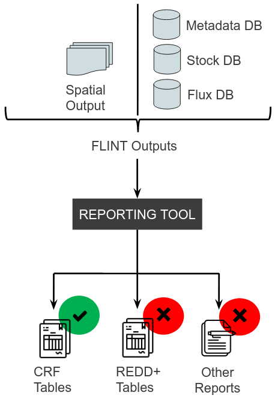

Long Term Vision
================

The Reporting Tool was simply brought together to support the generation
of tables, graphs, and other reporting artefacts, from the FLINT output
databases, to meet policy and other reporting requirements.

The support for these reporting requirements was not envisioned to
happen all at once; but rather in a piece by piece manner, with the
first version of the Reporting Tool (the current version) supporting the
generation of UNFCCC CRF tables.

Future versions are envisioned to support REDD+ reporting and other
reporting requirements.

