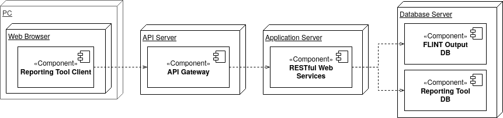

Major Design Elements
=====================

The Reporting Tool consists of four nodes hosting five major design
elements. These are as outlined below with subsequent chapters giving
more detailed explanations of each of the components.

Database Server Node
~~~~~~~~~~~~~~~~~~~~

+-------------------------+-------------------------------------------+
| Component               | Description                               |
+=========================+===========================================+
| FLINT Output Database   | The FLINT Output Database is the first    |
|                         | major design element of the Reporting     |
|                         | Tool. It sits on the Database Server Node |
|                         | and is implemented as a PostgreSQL        |
|                         | Database.                                 |
+-------------------------+-------------------------------------------+
| Reporting Tool Database | The Reporting Tool Database is the second |
|                         | major design element of the Reporting     |
|                         | Tool. It sits on the Database Server Node |
|                         | and is implemented as an Apache Cassandra |
|                         | Database.                                 |
+-------------------------+-------------------------------------------+

Application Server Node
~~~~~~~~~~~~~~~~~~~~~~~

+----------------------+----------------------------------------------+
| Component            | Description                                  |
+======================+==============================================+
| RESTful Web Services | The Reporting Tool’s RESTful Web Services    |
|                      | are the third major design element of the    |
|                      | Reporting Tool. They sit on the Application  |
|                      | Server Node and are implemented as Reactive  |
|                      | Spring Webflux Microservices. They are       |
|                      | packaged as Docker Containers which are in   |
|                      | turn orchestrated by Kubernetes.             |
+----------------------+----------------------------------------------+

API Server Node
~~~~~~~~~~~~~~~

+-------------+-------------------------------------------------------+
| Component   | Description                                           |
+=============+=======================================================+
| API Gateway | The Reporting Tool API Gateway is the fourth major    |
|             | design element of the Reporting Tool. It sits on the  |
|             | API Server Node and is implemented using Traefik HTTP |
|             | reverse proxy and load balancer.                      |
+-------------+-------------------------------------------------------+

Personal Computer Node
~~~~~~~~~~~~~~~~~~~~~~

+-----------------------+---------------------------------------------+
| Component             | Description                                 |
+=======================+=============================================+
| Reporting Tool Client | The Reporting Tool Client is the fifth      |
|                       | major design element of the Reporting Tool. |
|                       | It sits on Clients PCs as a Browser-Based   |
|                       | Application and is implemented as an        |
|                       | Angular Application.                        |
+-----------------------+---------------------------------------------+
